# [Data Umbrella](https://www.dataumbrella.org): Build a Career in Data Science

## Video Transcript
- Speaker: [Emily Robinson](https://twitter.com/robinson_es)
- Transcriber: [Kevin Kipkemoi](https://www.linkedin.com/in/kevkipkemoi)
- Book: [Build a Career in Data Science](datascicareer.com)

## [Video](https://youtu.be/HsFFuFYz7zE) (1:35:06)
<a href="https://youtu.be/HsFFuFYz7zE">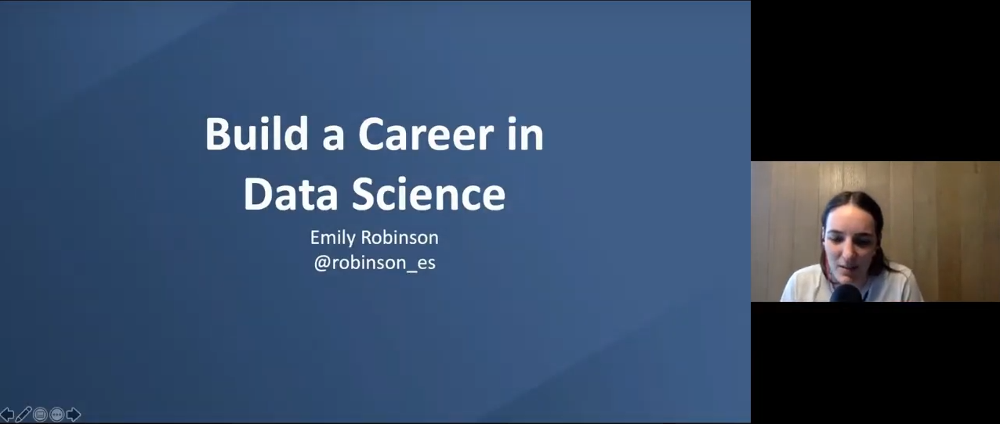</a>

### Slide 1: Agenda (0:00)
<a href="https://youtu.be/HsFFuFYz7zE?t=15">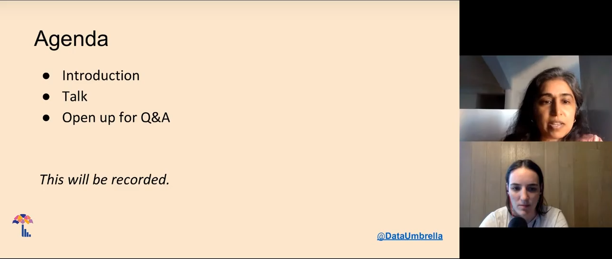</a>

Hi everyone welcome to data umbrella webinar um also co-promoted with NYC PYLadies I'm going to do a brief introduction and then turn it over to Emily for her presentation um and then after that what you could do is you can place any questions in the Q/A and um at the end uh Emily will answer
questions from them but just and just a reminder to reiterate this talk is being recorded.

### Slide 2: Intro (0:33)
<a href="https://youtu.be/HsFFuFYz7zE?t=33">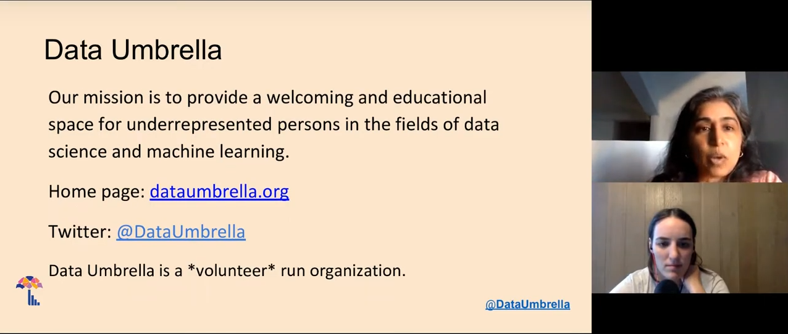</a>

About me, um, I'm a statistician and data scientist, um, I'm the founder of Data Umbrella and I'm also an NYC PYLadies organizer. 

### Slide 3: Data Umbrella (0:43)

The mission of Data Umbrella is to provide a welcoming and educational space for underrepresented persons in the field of data science and machine learning
we welcome allies who support our cause our home page is dataumbrella.org check it out we're also on Twitter and we are a volunteer run organization so any time spent organizing this event is all on
volunteer time. 

### Slide 4: NYC PyLadies (1:08)
<a href="https://youtu.be/HsFFuFYz7zE?t=68">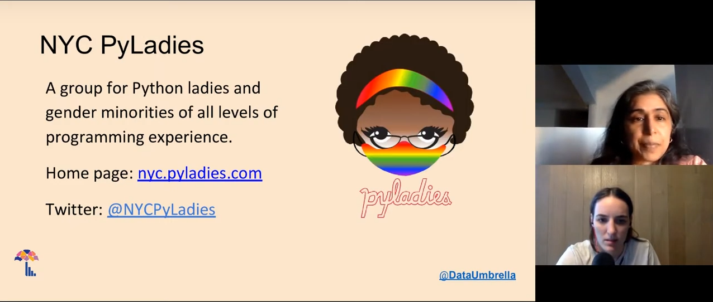</a>

PY Ladies is a global organization and the New York city chapter is one of the one of the local chapters, um, it's a group for Python ladies and gender minorities of all level check out our home page there is a very active Slack team that you can join and it's a really great community if you have questions on Python it's really it's really I recommend joining that. 

### Slide 5: Code of Conduct (1:36)
<a href="https://youtu.be/HsFFuFYz7zE?t=96">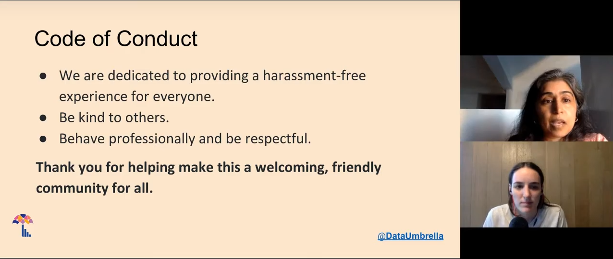</a>

Code of conduct we have a code of conduct, um, we're dedicated providing a professional harassment free experience for everybody um and uh thank you for contributing to making this you know to fulfilling the mission of this group which is to make it make an inclusive friendly community for people who are under represented in data science. 

### Slide 6: Data Umbrella Screenshots (1:59)
<a href="https://youtu.be/HsFFuFYz7zE?t=119">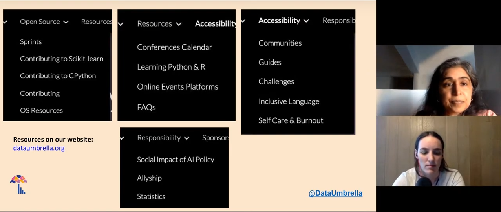</a>

At the data umbrella website there are many resources available and I've taken some screenshots about contributing to open source, about conferences, about other community groups, inclusive language, responsibility, social impact so please check it out later.

### Slide 7: Data Umbrella Screenshots (2:18)
<a href="https://youtu.be/HsFFuFYz7zE?t=138">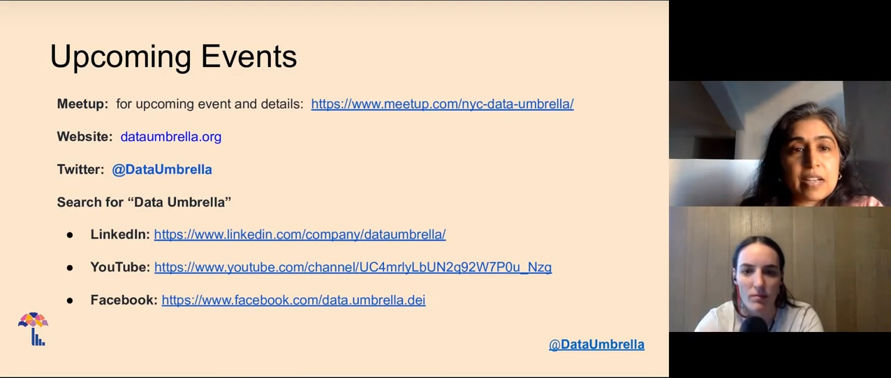</a>

For more upcoming events, uh the best place to find out about upcoming events is on the meetup page so the best thing to do is to join the meetup group we do also post them on Twitter and LinkedIn
as well and Facebook uh this talk is being recorded and a copy of it will be uploaded to Youtube
within the week all right so we're gonna get started and I'm gonna turn it over to Emily.

### Slide 8: Emily Robinson Intro (3:03)

All right. Hi everyone I'm just gonna start sharing my slides. Okay, right. Welcome thank you all again for joining me I'm very excited to be here.

### Slide 9: Talk Background (3:08)
<a href="https://youtu.be/HsFFuFYz7zE?t=188">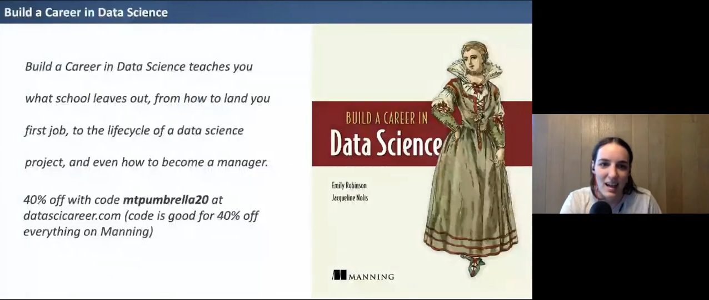</a>

I wanted to give a little bit of a background about where this talk came from so this talk is titled same title as my book, uh Build a Career in Data Science which is all about the non-technical skills and knowledge you need to get started and succeed in a data science career so if you haven't seen the book before if you're interested after this talk and learning more you can get 40% off with the code mtpumbrella20. I'll also show that at the end at datasidecareer.com and that code's also good for 40% off everything on manning which has a lot of technical books on you know coding in Python, or R, or whatever kind of things you want to do.

### Slide 10: What we'll cover (3:49)
<a href="https://youtu.be/HsFFuFYz7zE?t=229">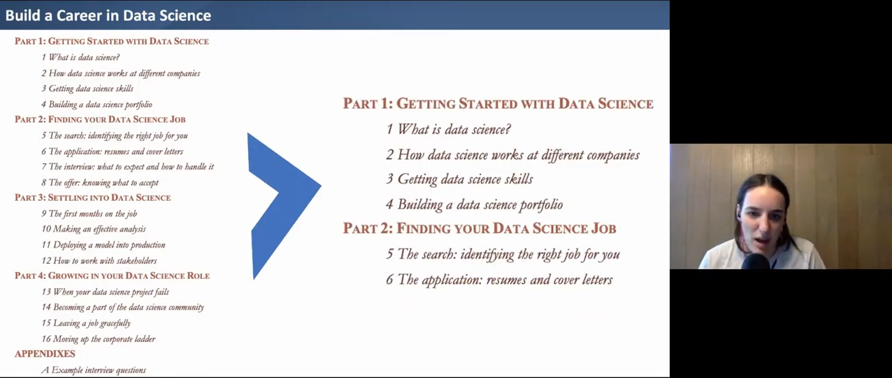</a>

In this talk I'm going to focus on the first six chapters of the book. So this covers getting started with data science, what it is, the skills, and then some of the first steps about finding a data science job.

### Slide 11: What is Data Science? (4:08)
<a href="https://youtu.be/HsFFuFYz7zE?t=241">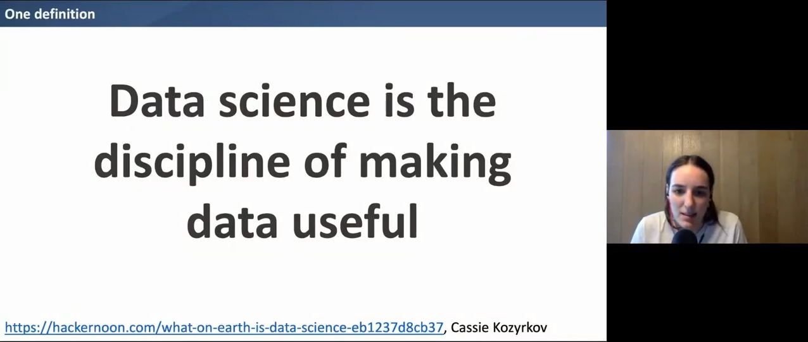</a>

All right what is data science? I really like this definition from Cassie Kozyrkov which is; that data science is a discipline of making data useful. I like this definition because it's pretty
all-encompassing, right, so folks can define data science as, oh it's just, you know machine
learning, it's just you know, this area but I really do think that just like you know you might not say you're a professional writer but all of us do writing as part of our jobs many people besides just those who have the title data scientists can be doing data science.

### Slide 12: Data science venn diagram (4:38)
<a href="https://youtu.be/HsFFuFYz7zE?t=278">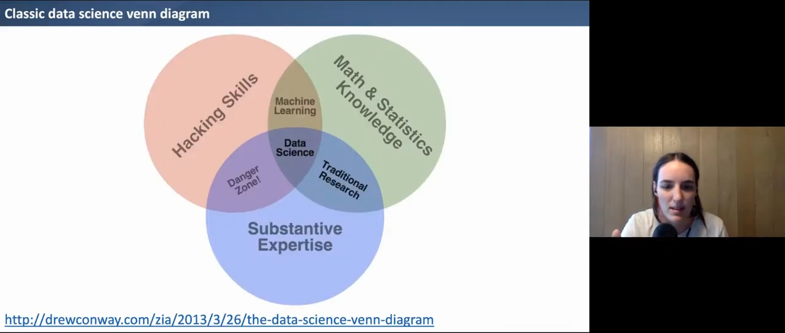</a>

You might be familiar with this venn diagram from Drew Conway, which is where does data science fall
it's the intersection of these three skills called like hacking skills math and stats knowledge and substantive expertise.

### Slide 13: Slightly updated diagram (4:53)
<a href="https://youtu.be/HsFFuFYz7zE?t=293">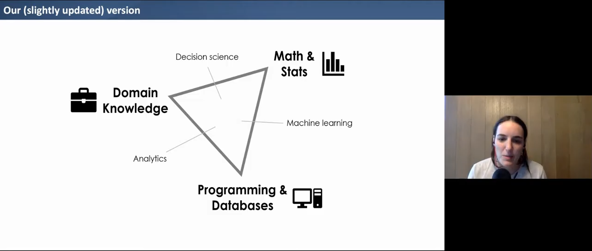</a>

And we updated this a little bit for our book although we didn't change much which is you know those same three basic areas, programming databases we call it domain knowledge instead and math and stats.
But we also wanted to highlight what are the areas of data science that are most associated with you know the intersections of these so I'm going to talk more about the difference between like analytics
machine learning and decision science but I wanted to make clear so rather than a venn diagram where you kind of either have it, or you don't that you know these are all levels right so you can have uh some people could be you know come from a computer science background and have really in-depth programming uh knowledge whereas maybe some other people come from statistics and are really strong in that so it's not an either or there's a big range of skills that you can have.

### Slide 14: Programming what you need to know (5:39)
<a href="https://youtu.be/HsFFuFYz7zE?t=339">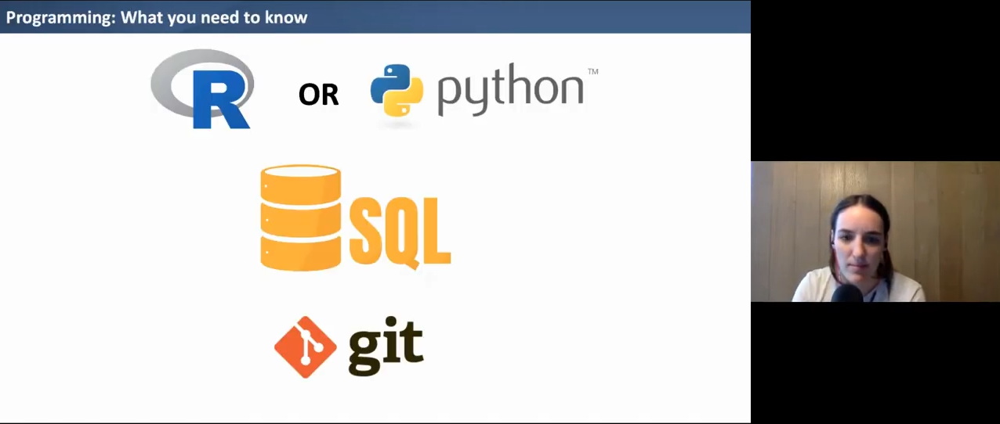</a>

But what do you need to know to get that data scientist job. I do think that you really need just
practically in terms of like the availability of positions to know either R or Python and this is going to be your main language day in and day out for doing things like cleaning data for making visualizations for writing reports so on and so forth but a lot of that data you'll need to get from a SQL database where it's stored and that's where SQL comes in so SQL is a query language that fortunately the basics of it you can pick up pretty much in a weekend or less and then you can go from there as you need it, and finally we have GIT. GIT you're not familiar with it is a version control system and the reason you need this is twofold one again just sort of practically it's something that's very useful in the job because what it allows you to do is rather if you've ever uh like saved you know word files and you've been like draft one, draft two draft three, draft ten because you wanted those old versions in case you needed something from them GIT basically does this for you so rather than saving every time you commit it gives a snapshot of what your code
looked like at that time so if you ever need to go back to it you can there's a bunch of other benefits as well but the second big one is it's a great collaboration tool so GitHub is one of the places you can host your code that you've saved with GIT and it's a way that many open source
projects are done through GitHub that's how you can contribute code or file issues, uh if you're working on a data science team that's how you could collaborate on a project so this is the third fundamental thing you need to know on the programming side. And I'll add here at the end a lot of
people ask like well what should I learn R or Python? This is a tough question my first advice is Python is generally more common to see in job descriptions so if you just want to go off like what's the most likely thing I'll have it's probably Python but R is more common in certain types of positions so sometimes more analytics positions or people coming from academia so it's worth it if you have an idea of what industry you want to work in. In data science or what type of data science job to take a look at those job descriptions and see do they say R do they say Python do they say both and if it seems like ah it's kind of like either or some of it is Python some of it is R you know I would try out both of them and see what you like better but I would definitely focus at the beginning on just getting good at one of them rather than trying to get to a medium level in both.

### Slide 15: Mathematics and Statistics (8:17)
<a href="https://youtu.be/HsFFuFYz7zE?t=278">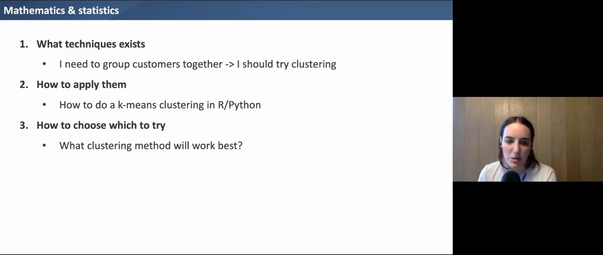</a>

All right so mathematics and statistics, I'm going to break this down into a couple of parts the first is knowing what techniques exist so for example if you're working at a company and they say hey I need to group customers together you need to know that oh I should try clustering that's a mathematical method that can make groups from this data well then you need to know how to apply them so how do you actually do a k-means clustering for example in R of Python but finally how do you
choose which to try so there are many clustering methods and rather than trying each one of them you know if you know something about the technique if you know that what cases they work well and what they don't work well in you can narrow down pretty quickly and figure out you know what technique
should I try and also some of the intricacies of do I have to normalize my data beforehand you know
all these other things of understanding a bit under the hood how it works.

### Slide 16: Mathematics and Statistics (9:03)
<a href="https://youtu.be/HsFFuFYz7zE?t=543">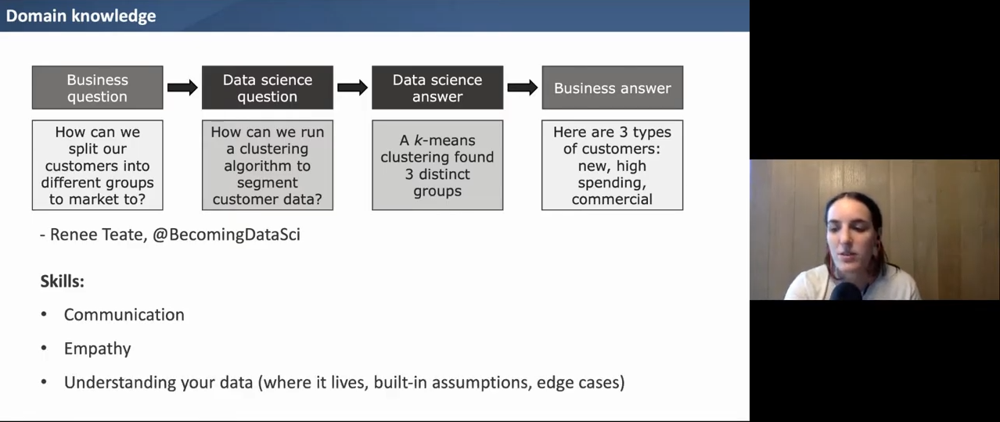</a>

Finally domain knowledge so i'm going to take this diagram from Renee Teate on to describe domain knowledge which is a core job of most data scientists is to take a business question for example how can we split our customers into different groups to market to and turn that into a data science question so in this case like the example I gave before how can we run a clustering algorithm to
segment customer data? Then you need to get the data science answer so for example your clustering
found three distinct groups but you can't stop there, because that's not very helpful to the business what they want to hear is something like hey here are three types of customers, new, high spending and commercial, for if you've been working for example with kaggle competitions they start at the data science question right they start with here is a data set you know predict this thing um but most the time you're not going to get something so clear-cut and you're going to have to work with the business stakeholder to try to figure out what are they actually trying to answer what are they looking for and things you need to do that successfully include good communication skills, empathy, and understanding your data which is huge so for example where where can you find your data what are some assumptions what are some edge cases and this is where you'll probably see a lot of tweets about working with messy data this is exactly about that because in the real world uh just data comes with so much mess you don't know if you should go and try to find another data set? Does another one exist? You do try to collect more data so you're going to need to be making these types of decisions.

### Slide 17: How to become a data scientist (10:36)
<a href="https://youtu.be/HsFFuFYz7zE?t=636">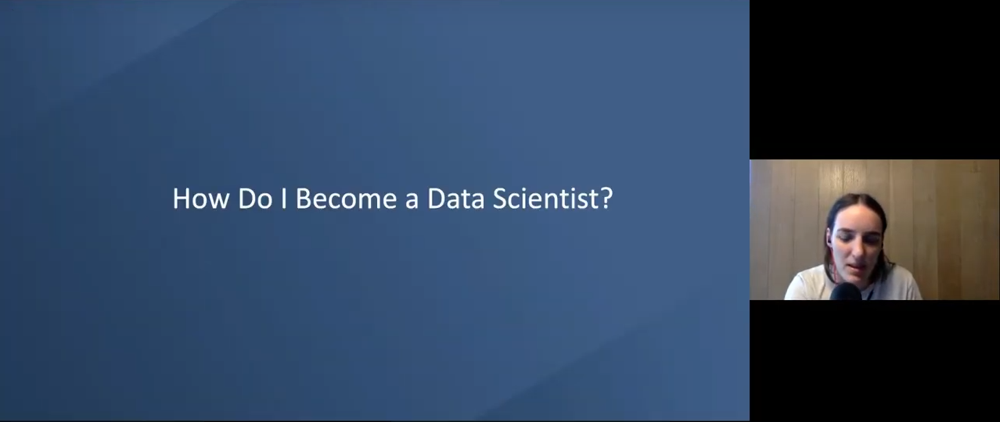</a>

All right so that's a little bit about what data science is what are some of the core skills you need to be a data scientist great but how do you become one. 

### Slide 18: Fake data scientists (10:46)

And I'm actually going to say all right what is like I disagree with first which is that they're selling as a fake data scientist so I pulled these uh headlines just like, how can you spot a fake data scientist, 20 questions for a fake data scientist, I just think this is total BS gatekeeping and to not let this dissuade you and to to make you worry that you know maybe because you don't have a formal degree in data science or you did a boot camp or whatever that you cannot be a real data scientist because you can.

### Slide 19: "Must know" lists (11:14)
<a href="https://youtu.be/HsFFuFYz7zE?t=674">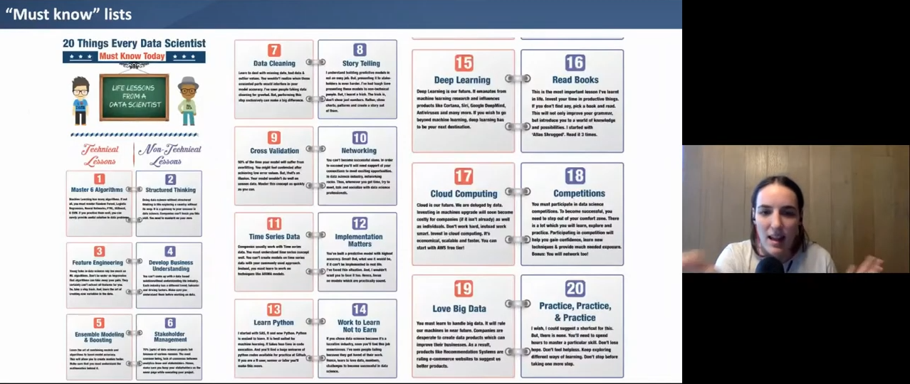</a>

And looking at these must-know lists so these are like 20 things you need to know like honestly I don't know a lot of these right I, yeah, I learned python once upon a time I don't use it much anymore I only worked with time series data seriously and a couple months ago so you don't need to necessarily know all of these things. 

### Slide 20: You don't need to know everything (11:31)
<a href="https://youtu.be/HsFFuFYz7zE?t=691">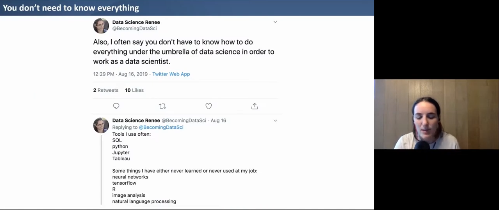</a>

And I really like Renee Teate's tweet here which is saying like hey look here are some tools I use often like SQL, Python, Tableau eer Jupyter, but I never used R or Neural Networks or Natural Language Processing and you'd find people say like oh that's absolutely fundamental to being data
scientists no I really think the skills I laid out at the beginning like you know some programming some math and stats uh you know some domain knowledge and communication skills is really what you need to get started and you learn the rest on on the way so if you have a project come up where you
need to do analysis of text you'll learn Natural Language Processing or you'll learn image analysis or TensorFlow but there are plenty of data science jobs we don't need to use that and it doesn't make you less of a data scientist for not knowing it or not using it.

### Slide 21: How to find a data science job (12:18)
<a href="https://youtu.be/HsFFuFYz7zE?t=738">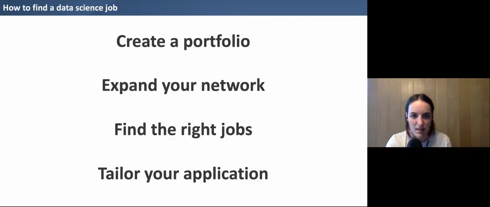</a>

In this talk I'm going to go through four ways that will help you find a data science job. The first
is creating a portfolio, then we have expanding your network, finding the right jobs and tailoring
your application.

### Slide 22: What is a portfolio? (12:31)
<a href="https://youtu.be/HsFFuFYz7zE?t=751">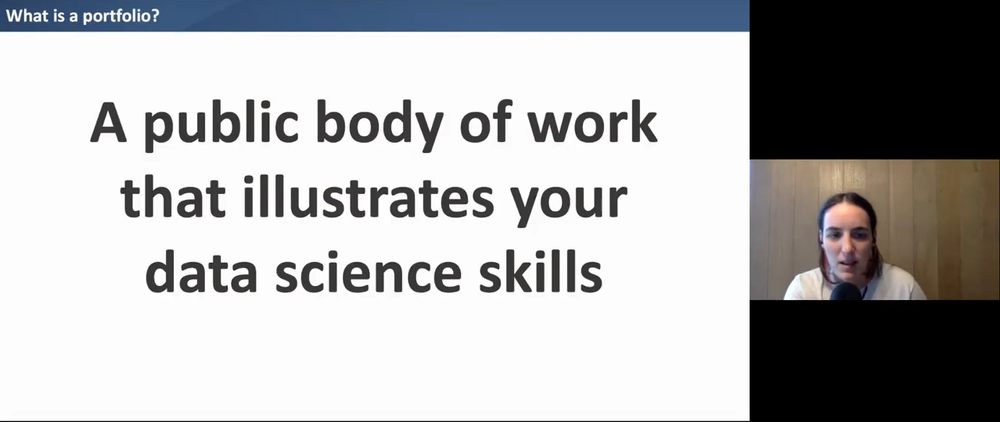</a>

Creating a portfolio. So I define a portfolio as a public body of work that illustrates your data
science skills.

### Slide 23: How? (12:31)

So how you can do that is one of two ways. This is a diagram from our book so you can start with a data set that you find interesting and find a question answer or start with a question and find data
related to it to make an analysis.

### Slide 24: Dataset -> Question (12:55)
<a href="https://youtu.be/HsFFuFYz7zE?t=775">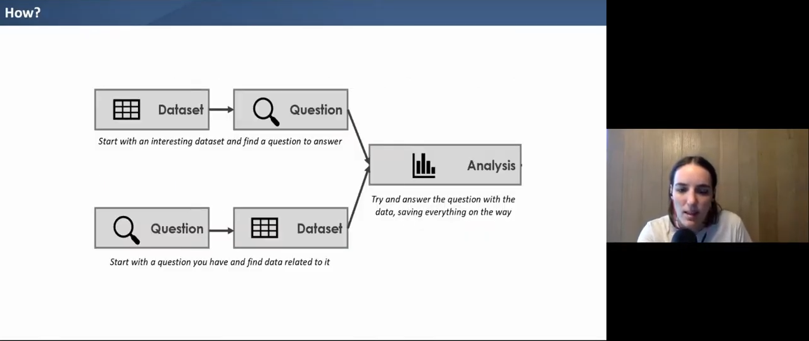</a>

So let's look at some examples. So a great place to find data sets is Tidy Tuesday this is a weekly project it's was started in the art community but these data sets are usually in CSV files so you absolutely can just download them and work with them in Python and as you can see there's data sets on you know star wars on comic books on bikes and this has been going on for a couple years now so I can almost guarantee you're gonna find at least one data set in here that's interesting to you and
worth exploring and this is nice because it's you know it's relative there's sometimes the data still messy but it's available and there's just it comes with a description or a data dictionary so it's a great place to get started.

### Slide 25: Dataset -> Question examples (13:32)
<a href="https://youtu.be/HsFFuFYz7zE?t=812">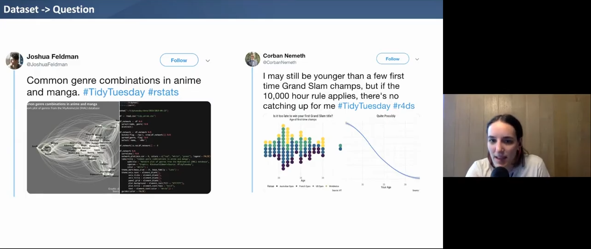</a>

Another ex, and here we have some people who've you know done this so this is someone sharing a visualization uh that they made about anime and manga genres and someone looking at ages of tennis champions so if you're looking for some inspiration you can see these people share it on Twitter with the Tidy Tuesday hashtag so it's another reason to choose these data sets because let's say you explore it you can then look hey what did other people who worked with this data set do.

### Slide 26: Dataset -> Question examples (14:02)

But you could also start with a question instead. So this is a blog post about Trump's tweets that started with a tweet that came out which said every non-hyperbolic tweet is from iPhone(his staff) every hyperbolic one is from Android. But this was essentially an assumption from looking at some of the tweets and how they differed so what Dave Robinson wrote this posted is he decided to analyze it so he did some sentiment analysis so he saw yes in fact the Android does have you know more words that are on the sadness scale or fear anger and this actually was picked up um by some news uh outlets and so what he actually did before the sentiment is he also showed look the pattern of the android and the iPhone's tweets these are clearly different like how they quote tweet, when they tweet, so on it definitely looks like these are different people and we have seen Trump tweeting on his Android so the other one must be the campaign staff so in this case there was a question and so Dave went out and got used the Twitter API to get the uh you know backlog of tweets and to analyze those.

### Slide 27: Tip 1: Include visualizations (15:08)

So some tips on when you do a data science portfolio project so you know what I've shown here is these are blog posts or tweets with it which I definitely recommend, so after you do the analysis share what you learned and a great thing to include is some visualizations so this is Jeff Kao who at the time uh that he did this project was a Metis student which is a boot camp that I also went to
and he's looking he's using uh you know Natural Language Processing to find to analyze these Net Neutrality comments to find that a lot of them the pro appeal were likely faked and I really love this visualization he chose because it might not be an obvious one but what he's showing is hey
look I didn't find that there were identical exactly identical uh messages but I found that there are
pretty much identical structures and so he does the colors here so he shows one messages Americans as opposed to the next one individual citizens as opposed to citizens rather than the FCC you know as
opposed to Washington bureaucrats as opposed to Washington bureaucrats so on and so forth so I thought this was a really cool visualization and definitely think about how you can catch people's attention at the beginning.

### Slide 28: Tip 2: Choose a topic you're excited about (16:17)
<a href="https://youtu.be/HsFFuFYz7zE?t=977">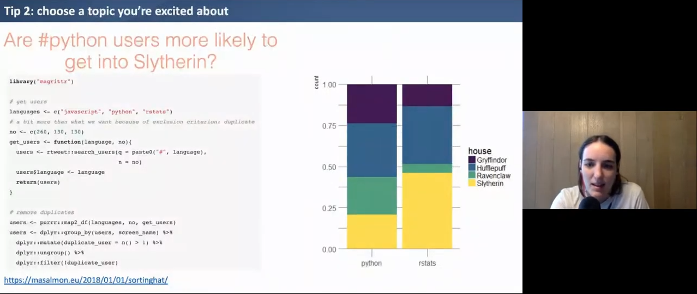</a>

Next, choose a topic you're excited about this is Masalmon uh writing a blog post on whether Python
users are more likely to get into Slytherin don't feel that you have to uh you know pick a project or
analyze something that you're like ah I'm like interested in finance I guess I do finance data like
find something that you like I you know one of my projects was about uh pokemon teams and what types I should have my pokemon team because I was playing pokemon and I wanted to know uh so you know it's
less important what the topic is and much more the kind of skills that you can show as you did it so for example showing that you you know here's some code that you did hey look I can get users I can write a function and get users from Twitter I can do some you know data filtering I can do this like map function and per so on and so forth.

### Slide 29: Tip 3: Limit your scope (17:03)

My third tip is limit your scope I really like this quote from a blog post says you know perfections can be a real hurdle and next time I'm not going to wait so long to push something out because I think that last mile can be a big barrier feeling like oh you know I could do one more thing or you know what if my code isn't quite good enough so try at the beginning like it's okay if you don't answer every question you have about a data set maybe say hey I'm gonna try to answer this one question or I'm gonna try to make this one visualization or I'm you know I want to do this project because I'll need to you know I have to get some data from the web and so I'm just you know I'm just going to get the data and I'm going to publish how I got the data I'm not going to worry about doing
anything with it and that's perfectly fine and it's definitely better to have something out there than nothing

### Slide 30: Making progress (17:49)
<a href="https://youtu.be/HsFFuFYz7zE?t=1069">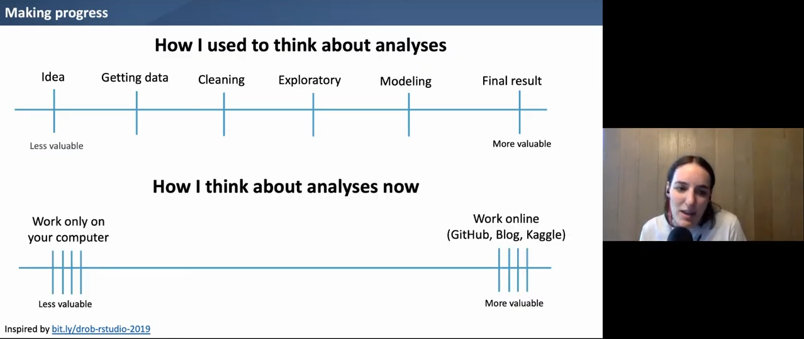</a>

And on that point this is inspired by uh same Dave Robinson from his R-studio keynote which I definitely recommend watching which is um on the unreasonable effectiveness of public work but basically I used to think all right like an analysis essentially it's getting more valuable as I go
right I have an idea, and then I get the data, and I clean it, I explore and so on and you know this this is true from your own learning standpoint like you're learning things along the way but in terms of as part of your portfolio as some work that you can show someone when you're applying for jobs it really you just need to get it out there work on your computer is so much less valuable than something that's on GitHub or a blog or Kaggle just something public because it doesn't have to necessarily be you go and tweet about it but something that if you're in a job interview you could say hey go to this URL or put on your resume here's where my projects are hosted so that someone can see it.

### Slide 31: The full process (18:44)
<a href="https://youtu.be/HsFFuFYz7zE?t=1124">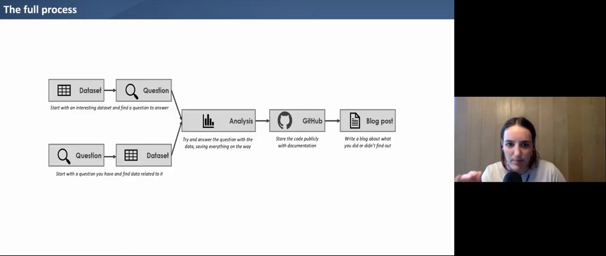</a>

And on that point you know this whole process is getting it public by putting it on GitHub and then writing a blog post about it 

### Slide 32: Putting it on GitHub (18:53)
<a href="https://youtu.be/HsFFuFYz7zE?t=1133">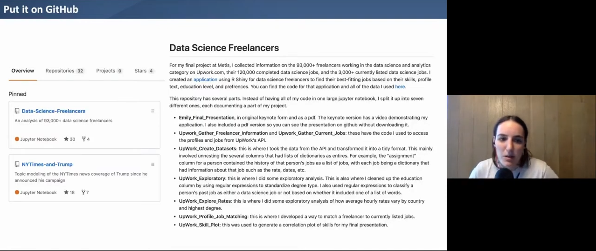</a>

So putting it on GitHub I this is an example from as I mentioned I went to Metis my final project on
data science freelancers and the helpful thing when you're putting something on GitHub is to write a readme so to help people understand hey what am I even looking at so in this case I said uh this is a
project where I got information on 93000 freelancers, 3000 jobs currently and here's how the repo is organized with these different scripts and what each one of them does and right as I mentioned this is also a good way if you haven't used Git or GitHub before to practice those skills. 

### Slide 33: Blogging (19:25)
<a href="https://youtu.be/HsFFuFYz7zE?t=1165">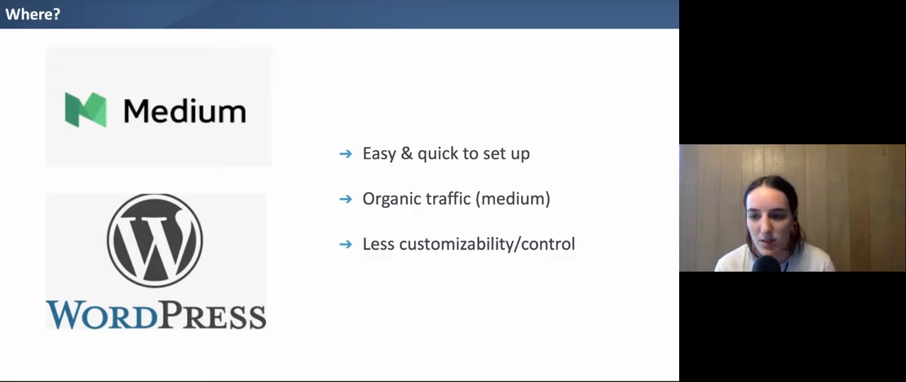</a>

On the blogging side well where do you want a blog there you can go with something like Medium or WordPress which has the advantage of being easy and quick to set up you get some organic traffic on Medium if people search say data science or the topic or your blog post but on the other hand there's less customizability and control so for example I know Medium seems like more things have been going behind a paywall if they decide that's what they want all articles to do you can't do anything about that.

### Slide 34: Blogging (19:52)
<a href="https://youtu.be/HsFFuFYz7zE?t=1192">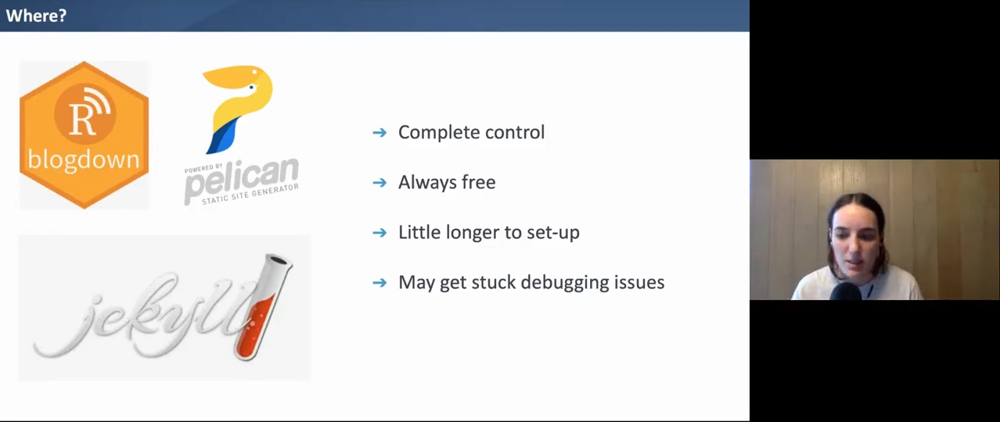</a>

On the other hand if you make your own website you really do have all that control so that's a big advantage it's always going to be free it does take a little longer to set up but there are more tools that make that easier I actually think uh with Fast AI also as a new tool I'm working from GitHub to publish a blog um so i should add that here and you may get stuck debugging issues so I've
definitely I use R blogdown personally which is an R package I've gotten stuck occasionally but
overall I like it because I'm in complete control it works very well with R and the other advantage of it is that if you are someone who really wants to customize it you're like I want this exact font, I want this color scheme, I want this there's a lot of themes that you can get um pretty easily that you can then see okay uh this uh type of you know theme comes with these colorings but then you can customize from there and this you know the sky is the limit.

### Slide 35: Explain your analysis (20:46)
<a href="https://youtu.be/HsFFuFYz7zE?t=1246">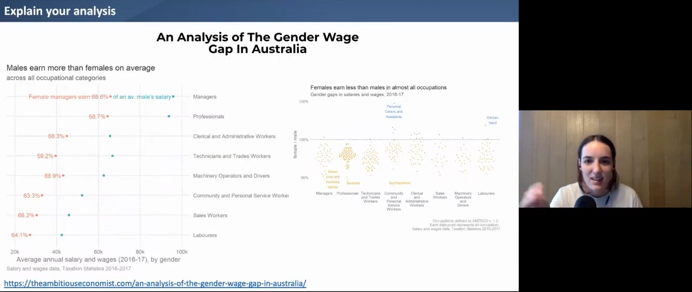</a>

So some things you can blog about once you have your analysis well of course you can explain it right so this is someone explaining their analysis from a Tidy Tuesday data set about the gender wage gap in Australia.

### Slide 36: Teach a concept (20:57)
<a href="https://youtu.be/HsFFuFYz7zE?t=1257">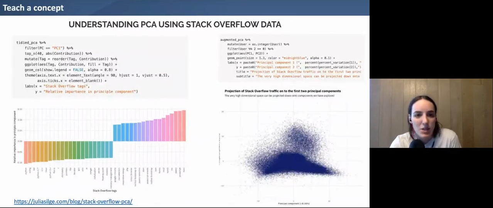</a>

You could teach a concept so Julia Silge here is showing uh Principal Components Analysis using
StackOverflow data this is a great thing if you say just took a course on a statistical technique
or machine learning write a tutorial about it show other people how to do it write the thing that
you wish you had had at the beginning because it would have made learning it so much easier.

### Slide 37: Share your experience (21:17)
<a href="https://youtu.be/HsFFuFYz7zE?t=1277">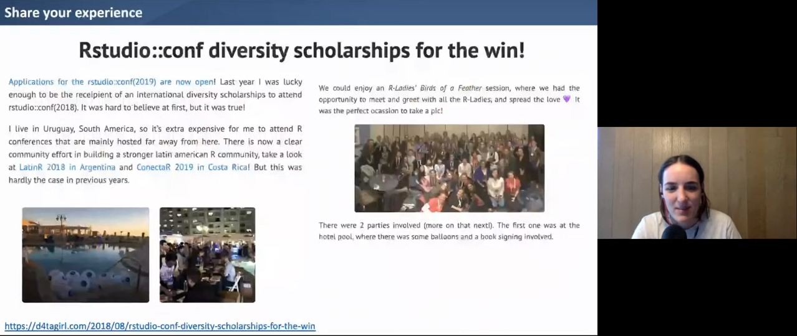</a>

Or you can share your experience so in this case there's a post on Rstudio conference from Danielle
Vazquez who got a scholarship to go and so if you attend a conference if you go to a meetup talk that you really like you can write about it you can talk about what you enjoyed if the talks were recorded for conference say which ones you recommend going to and so on 

### Slide 38: Give advice (21:40)
<a href="https://youtu.be/HsFFuFYz7zE?t=1300">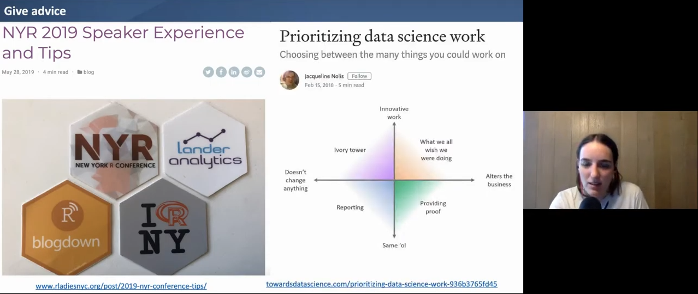</a>

You can also give advice so this is a blog post from uh the New York about the New York R conference from R ladies New York city which had some speaker experience and tips or my co-author Jaclyn Nolis about prioritizing data science work so if you have been say working the field or related field and you want to give advice that's a great thing to write a blog post about and it may be faster than doing say a whole analysis because you might already have every all the advice you need in your head or think about the advice that people come to you for how can you put that in blog post and share with the world.

### Slide 39: Expanding your network (22:14)

So next we're going to talk about expanding your network.

### Slide 40: Expanding your network (22:19)
<a href="https://youtu.be/HsFFuFYz7zE?t=1339">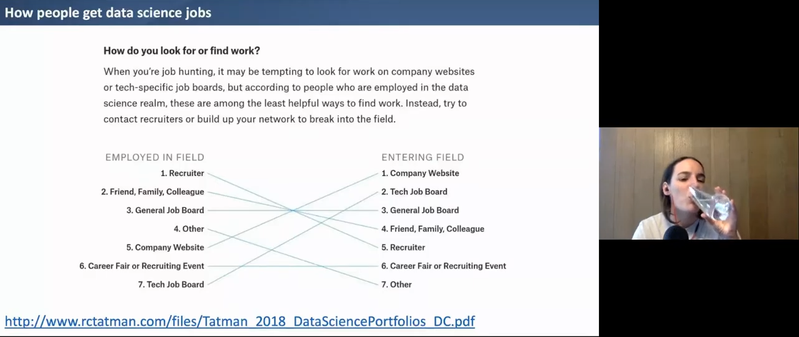</a>

This is Rachel Tatman talking about the difference um this is research in Kaggle about the different ways that people already employed the field found their job versus those entering the field and we see a big one about employed in the field is recruiters and friends families and colleagues way more than those entering the field and those are about your network those are about who do you know in case of friend and family and colleagues but the recruiter is also apersonal relationship so this is a really common way that people get jobs.

### Slide 41: Meetups (22:50)
<a href="https://youtu.be/HsFFuFYz7zE?t=1370">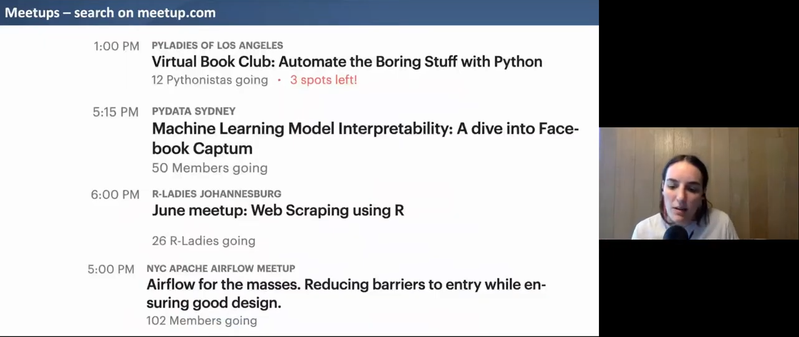</a>

How do you build it though well you know you're here tonight um or this afternoon or in the you know
the in the early morning for folks in certain time zones going to a meet up that is one of the
advantages of COVID is that if you're in an area that is you know say maybe you're in a rural area or
a small town there weren't any meetups going on locally well most meetups have moved online now and
some of them are doing uh networking stuff before and after or you can you know maybe you can meet
the speaker or other things like that so see especially for some smaller meetups uh you know it and if you are someone who say like lives in Los Angeles and you hadn't been before to a PyLadies Los Angeles meet up maybe think about going because even if it has to be virtual for a while there's
still people local they're probably working at local companies and they can eventually help you out in your job search.

### Slide 42: Twitter (23:41)
<a href="https://youtu.be/HsFFuFYz7zE?t=1421">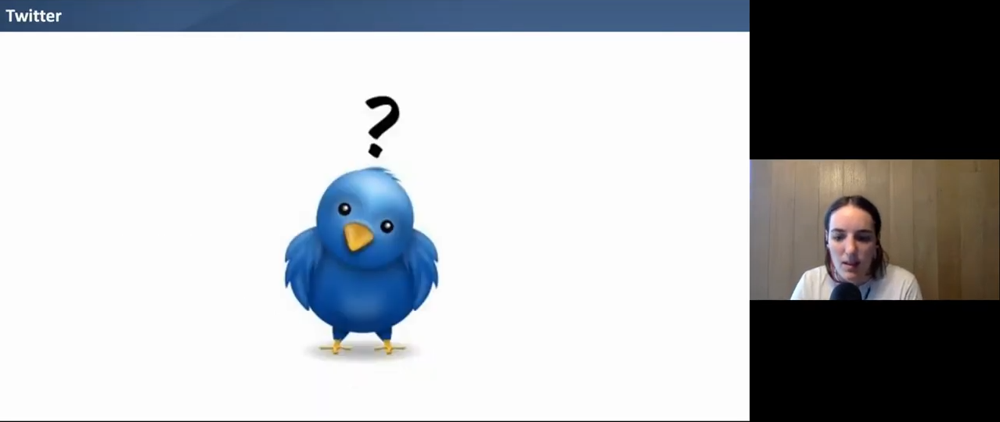</a>

I'm a big Twitter person probably a little bit too much but I will admit it definitely confused me at the beginning.

### Slide 43: Ask for help(use hashtags) (23:49)
<a href="https://youtu.be/HsFFuFYz7zE?t=1429">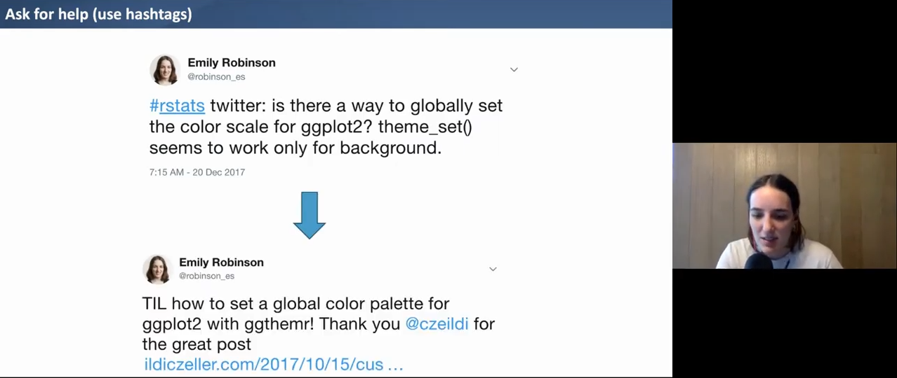</a>

How I use Twitter is in a couple ways the first is ask for help and with that please use hashtags um rather than adding a specific person like adding Hadley Wickham like it's definitely understandable but the hashtag is great because people follow the hashtag so they can retweet it they can see about answering it so even if you don't have many followers this is a good way to get visibility and to get people looking at your question so in this case I asked about globally setting a color scale for
ggplot2 and i got an answer and when I did I wrote a follow-up tweet saying like hey think you know
thank you for this post on how to do that so this is one thing you can use Twitter for.

### Slide 44: Ask for help(use hashtags) (24:29)
<a href="https://youtu.be/HsFFuFYz7zE?t=1469">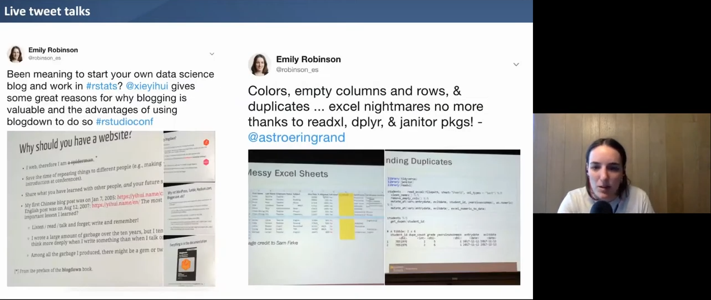</a>

You can also live tweets talks so pre-COVID times this was me live tweeting uh Rstudio conference and also a meetup and I sort of do this in two ways like one is to take notes for myself of some of my big key takeaways but the other is to share with people who didn't get to go to the meetup like
what I think that they could really learn and benefit from so this is a nice way to take notes
for yourself and share some knowledge.

### Slide 45: Share your work (24:55)
<a href="https://youtu.be/HsFFuFYz7zE?t=1495">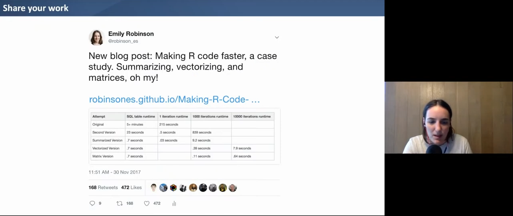</a>

And you can share your work so when you do write that blog post when you do publish that GitHub repo share it point people to it again you can use hashtags um as a way if you don't have a lot of twitter followers for more people to see it but this is you know I think writing the portfolio the main point is not that you get like hundreds of week retweets or you get thousands of you on your post it's more for the learning yourself and to have that available when you're talking and interviews about projects you've done but it is a nice bonus um if it can help other people and other people can benefit from it.

### Slide 46: Share other people's work (25:28)
<a href="https://youtu.be/HsFFuFYz7zE?t=1528">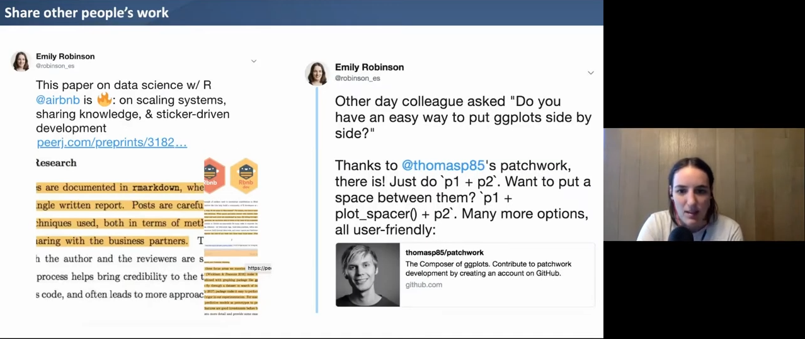</a>

You can share other people's work so I enjoy tweeting about packages I find useful papers again sort of this dual benefit of thanking the person who wrote it showing that I appreciate it making a note for myself and hopefully helping other people discover it 

### Slide 47: Reaching out (25:43)
<a href="https://youtu.be/HsFFuFYz7zE?t=1543">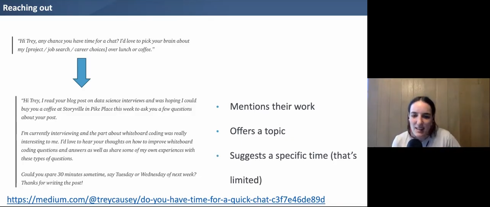</a>

Now that's like sort of broader like networking Twitter but what if you want to reach out to a specific person that you're interested in maybe because uh some work that they do a blog post the company they work on so on and so forth I like this post from Trey Causey which is called do you have time for a quick chat and what he does is he walks through I first share is what is a typical message he receives which I have here which like hey do you have any time for chat I'd love to pick your brain and he shows how he would revise that so the first thing is to mention the work so tell them why are you reaching out oh it's because I read this blog post on data science interviews so this shows like there's a reason you pick this specific person which hopefully there is rather than saying mass messaging or mass connecting with everyone on LinkedIn tell them why you're you're interested in talking to them specifically this also shows that you're going to have questions that weren't answered and things that were publicly written before so for example if folks ask about you
know my job search advice often I'll say hey I wrote some obviously wrote this book which you have to pay money for but I also wrote these free blog posts I have these recorded talks you know why don't you start there and let me know if you have any follow-up questions second this person offers a topic so they say hey i'm currently interviewing and the part about whiteboard coding is interesting I'd love to hear your thoughts about whiteboard coding questions and answers in my own
experience so this lets them know you have a specific thing you want to talk about rather than just
like I just want to talk about everything like you know my whole job search and finally suggest a specific limited time so in this case could you spare 30 minutes on uh say Tuesday or Wednesday
because this gives one the person you're reaching out to a better idea of what kind of commitment this will be and it shows them that you're not necessarily expecting on their first meeting with you to take two hours of their time. 

### Slide 48: Reaching out (25:43)
<a href="https://youtu.be/HsFFuFYz7zE?t=1543">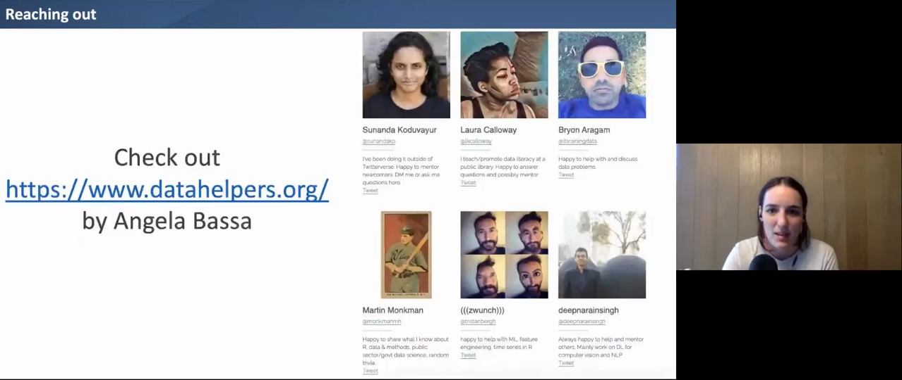</a>

If you're looking for people to reach out to definitely check out datahelpers.org by Angela Bassa
so she put out a call for folks who are interested in helping aspiring or junior data science people
or even some seniors with specific problems and people volunteered so I just took a screenshot of some of the volunteers and you can see some of them list specifically what they they can help with so for example that you know public sector, government data or machine learning or time series in R so this is a really nice place because these people have already said that they're interested in helping out and mentoring a bit about their background what they can do so I definitely recommend
starting with this list and you can reach out and say hey i saw you on data helpers maybe see if they have blog posts other public work if they don't you can just say hey I saw you on data helpers
um I would love to chat about your work at a public library I you know have so and so background and this is very interesting to me.

### Slide 49: Reaching out (28:29)
<a href="https://youtu.be/HsFFuFYz7zE?t=1709">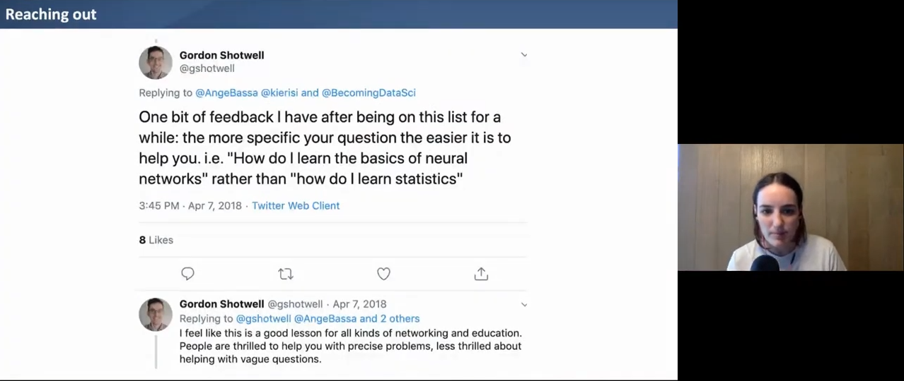</a>

And then another tip from Gordon Shotwell is do try to be specific so for example he says here how do I learn the basic of neural networks versus how do I learn statistics because you know that's the distant question it's so broad and there's so many ways to learn statistics and there's so many specific types of statistics and it's like okay but what so the first question kind of like what do you want to use it for and this is definitely like hard when you're starting out in a field
because you're like I don't know like I that's what I need you to tell me is what statistics to learn
but if you can like you know you can even ask that you could say hey I'm very new to this field I don't really know what area to start with do you have a book recommendation uh or something and that can get you started and you'll be like okay I read this book and then I want to learn you know I got really interested in this area let me learn some more and ask some more people about that.

### Slide 50: Finding the right job (29:16)

Finding the right job uh I do feel like sometimes it's like I just want you know a data science job like any data sciences job but I do think it's worth it to take some time and think about like okay but what kind of job do you want.

### Slide 51: Let go of the "data scientist" title (29:30)
<a href="https://youtu.be/HsFFuFYz7zE?t=1770">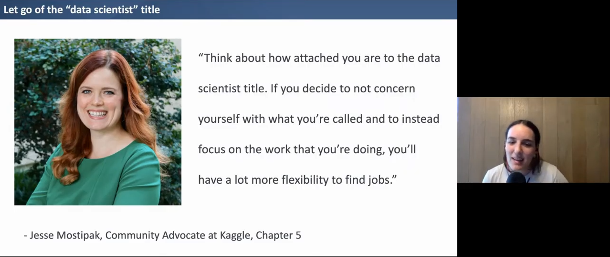</a>

And that job actually may not have the data scientist title so this is Jesse Mostipak we interview in chapter five uh each chapter of our book uh we have 16 chapters has an interview with a practicing data scientist or data science manager at the end and she says think about how attached
you are to the data scientist title like if you decide to not concern yourself with what you're called and focus on the work that you're doing instead you'll have a lot more flexibility to find jobs that's really true especially as someone starting out in the field it is easier to get a related job let's say a data analyst title or program analyst or research and evaluation specialist like I said at the start there's so many jobs that are data science related that also at another company might have the data scientist job title for that exact same job so if if you're able to and willing to uhm definitely recommend being flexible and I talk about this in this chapter but you know for example just searching teams terms like data and analysis rather than I must have the data scientist title.

### Slide 52: Figure out your specialty (30:33)
<a href="https://youtu.be/HsFFuFYz7zE?t=1833">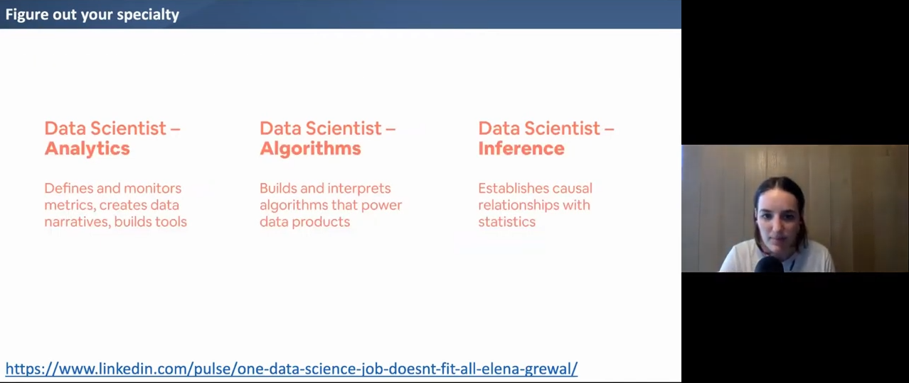</a>

But in data science there are a couple of areas of specialties and so one and I want to divide these into these three categories that AirBnB uses because I really like it the first is analytics so this is uh sets here like defining monitoring metrics creating data narratives building tools uh so this you know might be called the data analyst at some companies but it's basically you know taking data that's there or gathering it and presenting it to people whether in a report or in a dashboard often you work very closely with product teams or other teams to help them with their analysis needs then
we have algorithms you can also call machine learning so this is about you know building and interpreting algorithms that power data products so this is I think maybe what's a lot of people think of when they think of data scientists is like the person working on the Amazon you know recommendation algorithm that pops up when you're looking at a product page and finally we have inference which we've also called in our book decision science which is the really statistics part of
like establishing causal relationships so for example this would be someone working on the Microsoft experimentation team you know trying to figure out all right we run this uh A/B test we you know show
half of people the old experience half the new we have these numbers about how it performed but can we infer from that you know how do we how do we make sure it's not just noise and confidently infer that uh you know one is better than the other.

### Slide 53: You don't need to meet all of the "requirements" (31:57)

When you're looking at job descriptions don't worry about meeting all of the requirements a lot of time they're wishlists and you really only need to meet 60 or 70 of the core requirements so that does mean for example if they say you know we need someone with three years of experience coding in Python if you've never coded in Python or any like any language at all yeah you're probably not qualified for that job but if you have two years of experience coding it or two years of professional and three years in school even if they say three years professional you probably will be they'll be very happy with you so don't let the kind of job post looking for the data science unicorn intimidate you.

### Slide 54: Consider the type of company matters (32:38)
<a href="https://youtu.be/HsFFuFYz7zE?t=1958">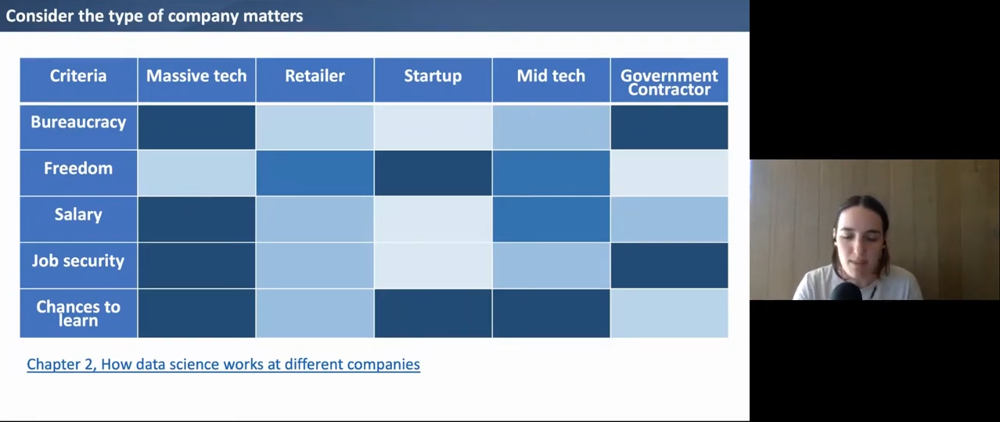</a>

Finally consider the types of companies so in our chapter two we lay out uh five different example companies and of course not all companies meet this um but you know a fair amount of them fall into it so for example you could have massive tech you could have your your Google your Facebook you could have a startup you could have like a Midtech like Lyft, AirBnB a government contractor so on and so forth and what i put here in this kind of matrix is how those differ along these axes of how much freedom do you have what's the salary like what's the job security and there's not a you know a best answer for some people you may say you know what I really value job security and so I am fine if like you know there's a little bit more bureaucracy in my job the salary is not quite as great
because at the end of the day like I want to have job security and I want to work more of a nine-to-five job so you know I think like a government contractor would be a great one or maybe
on the other hand you're like I really love freedom I love moving fast I want lots of chances to learn and I don't care if there will be a senior data scientist help me so maybe you go to a startup
so there's nowhere to answer this but you really want to reflect on what are your needs and what are you looking for in a company.

### Slide 55: Tailoring your application (33:48)
<a href="https://youtu.be/HsFFuFYz7zE?t=2028">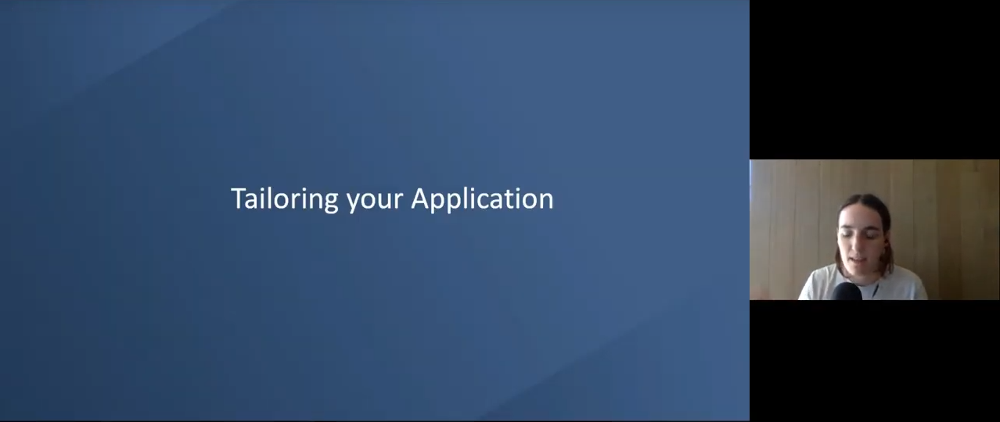</a>

So finally I want to talk about tailoring your application.

### Slide 56: Writing a good resume (33:55)
<a href="https://youtu.be/HsFFuFYz7zE?t=2035">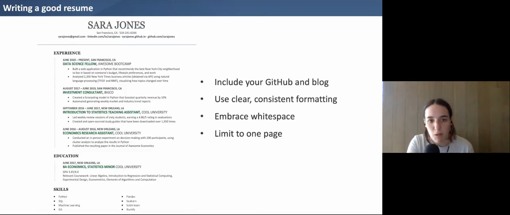</a>

So writing a good resume this is an example resume we share in our book and there are a couple of things I want to highlight and you definitely don't have to use this exact format but some of the things I like about it are it includes your GitHub and your blog so if you put this work into making a project portfolio you should share it. It uses clear and consistent formatting so the color scheme is grey for most of the things but the title of the position or the major is highlighted in green the font stays the same and it's not necessarily again like the color isn't the same throughout this resume but the same type of information always has the same type of color next embrace white space you don't need to have a super cluttered resume that packs everything in you can let it breathe a little bit because it makes it a lot easier to skim and limit it to one page now there are exceptions to this so certain industries might look for a longer resume if you have 20 years of experience you're switching a data scientist maybe you need two pages but you know most people I would say you know under 10 years you really can fit it into one page how you can do that for
example is you know focus more on the things that are relevant if you had a job for five years that's really not that relevant to data science you can just have one bullet point where you describe it and devote more time to the things you're more of or you can do a column format and put some things on the side you can get creative but in general again because people are not going to
spend that much time looking at your resume you want to make sure they can quickly hone in on what's important.

### Slide 57: Quantify what is important (35:26)

So for those bullet points try to quantify your impact so rather than saying you ran A/B test on email campaigns say you conducted 20 A/B tests on email campaigns resulting in a 35% increase in click rate and a 5% increase in attributed sales so this quantifies both okay like how much of something did you do and then also what was the impact okay if it I just wrote a conducted 20 A/B
test on email campaigns well A/B tests aren't valuable in and of themselves they're valuable because
of you know the the results that they can have showing you that hey this thing this uh you know treatment is better you should launch and your sales will increase so try to try to figure out okay rather than saying just like i wrote this report you know like listing what's on your job description what did it matter did it increase sales for the company did it like you know decrease the amount of time it took someone to do their job because you automated something like really think
about like why would other people care that I did this.

### Slide 58: Relate to data science (36:22)
<a href="https://youtu.be/HsFFuFYz7zE?t=2182">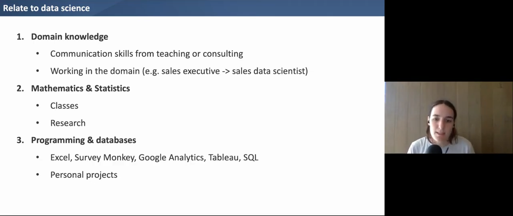</a>

And relate it to data science so you know even if you don't have like a data scientific analytics background there's plenty of types of jobs that are really relevant so for example were you a teacher teacher or consultant there you have communication skills right like you had classroom you know for teaching and classroom management you had to figure out how to explain math to maybe you had an AP class uh for you know bc calculus but you also had you know math students who were you know
more remedial and so you had to figure out how to tell your lessons uh could did you work in the domain so for example if you're a sales executive maybe you could be a data scientist for the sales team and that would be hugely valuable to like have been in that system know how to use salesforce like know what sales executives are thinking so on and so forth. Math and statistics you know what
classes have you done that are related did you do any undergraduate research so for example let's say you majored in psychology what did you take a psychology statistics class did you do psychology research where you had to do statistical tests or data cleaning or data collection really try to think all right how have I used math and stats even if the class wasn't necessarily or the research wasn't called that. And finally programming and databases so if you haven't worked in data science
have you used Excel, Surveymonkey, Google Analytics, Tableau, SQL any of these tools they're not all
tools some of them are tools you might still use as a data scientist especially SQL but even if you never use Excel again you can talk about like the projects that you did with and it shows that you've worked with data even if you use a different tool and of course the personal projects that
we talked about with the portfolios.

### Slide 59: Writing a good cover letter (37:58)
<a href="https://youtu.be/HsFFuFYz7zE?t=2278">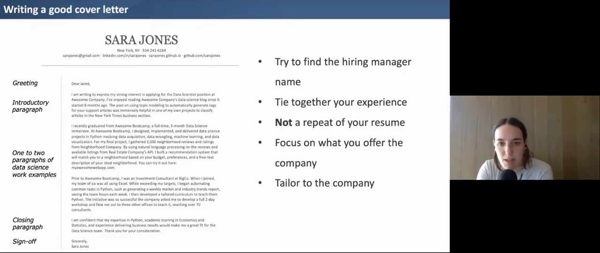</a>

This a cover letter is not always required but it sometimes is and what you want here is first try to
find the hiring manager name if you can so sometimes that's listed in the position uh sometimes you can look on LinkedIn if it's a smaller company especially like it's okay if you go two levels up so say you're applying to a company and you find a director of data okay maybe they're not who's going to be your manager but it still shows you did research on the company you know to try to figure out who would be a relevant person and it shows that you're tailoring to this company next tie together your experience so your cover letter should be a story it's not just a repeat of your resume but instead saying like okay how does all this experience fit together so give some examples of uh you know the work that you've done talk about a little bit more so you know here you can read like prior to this I was at boot camp I was an investment consultant like I took people through Python I tailored a curriculum so on and so forth and focus on what you can offer to the company so the company's not interested in like oh this place would be a great place to start my career like or you know it's nice to say that you love it and you research it but they really care about like well what are you gonna do for us why should we hire you and what you want to show is look I can solve a problem that you're facing with this experience that last point tailored to the company so if uh you know for example it's in let's say you multiple projects and one of them's I don't know like related to web data you know website dot com web companies that you're applying to maybe use that project because that's going to be more relevant to them.

### Slide 60: Conclusion: Take away points (39:34)
<a href="https://youtu.be/HsFFuFYz7zE?t=2374">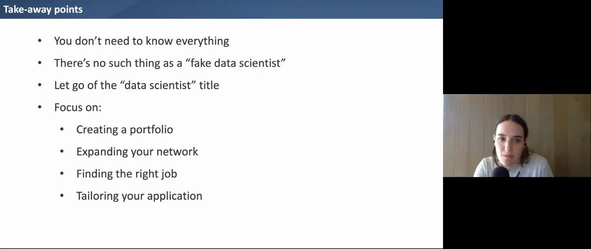</a>

So I want to close out by doing a brief recap of some of the takeaway points so first you don't need to know everything don't let yourself get paralyzed by these must-know lists or all these things you can learn data science or all the millions of courses because no one knows everything you don't need
to know everything to do you know a great thing at your job and you'll always be learning so don't let that hold you back there's no such thing as a fake data scientist I I just really don't like this point um you know of there being a fake data scientist no you know if if you data science is a broad enough umbrella for us all but that being said you may want to let go of the data scientist title because there's so many positions where you've been doing interesting data science work that may not have that title for whatever reason and will also honestly have less competition for those jobs so maybe that's something you want to have eventually but for your first job try to focus more instead on like okay what can I learn how can I gain experience and not so much what I will be called
so when you're applying a job remember to focus on creating a portfolio to one help yourself learn and to show off your skills, to expand your network to find the right job not just any job and to tailor your application.

### Slide 61: Thank you (40:50)
<a href="https://youtu.be/HsFFuFYz7zE?t=2450">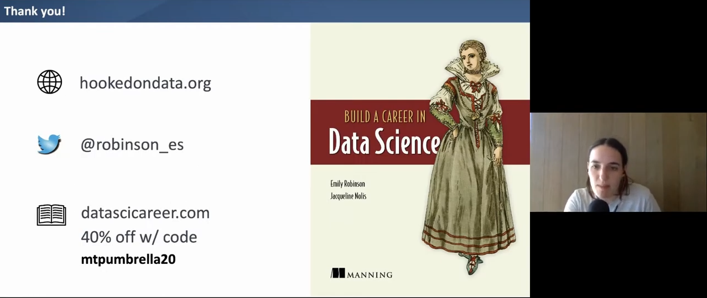</a>

And so with that I want to thank everyone for coming and I'm going to take questions in a minute if you enjoyed this talk you can find some data science career related posts and some other data science topics on my blog hooked on data.org you can also find me on Twitter @robinson_es like I said this is all covered in the book with a bunch more stuff uh that's available at datascicareer.com
and you can get 40 off with mtpumbrella20. Thank you.

### Questions

Yes and I am open to answering questions as soon as I can remember how to not share there we go how to stop sharing great so do you want to read the question yeah that would be helpful okay so the first one that had five upvotes is
How um different is a data analyst role from a data scientist role? 

Ah great question so this is hard because a couple reasons one is there's definitely disagreement about this so some people divide it as it's about the tools that you use so like a data analyst will use a Graphical User Interface something like Tableau or Excel whereas a data scientist uses scripted
language like R or Python other people say it's about the type of problems that you tackle so I just
listened to the super data science podcast with uh Krill and he said he divides it as a data analyst is determining the exact term it's basically doing like descriptive analytics about the past what's happened before and a data scientist is doing predictive what's going to happen and some uh also some analysis of what would be prescriptive what should we do based on that so that's another way so there's all these different ways to divide it and the other problem is what it means that companies vary so much so there's a good blog post from Lyft about how they changed all of their data analysts to be data scientists and their data scientists to be research scientists two years ago Etsy where I used to work did a similar thing whereas previously the data analyst team we were working we were using R and Python and stats and you know doing some uh you know even some machine learning but we were embedded with uh um you know sort of uh other teams and basically we said we did data for data science for human consumption the data scientist team was about working on the ad algorithms or the search ranking algorithms so they did data science for machine consumption but then since I left they changed their title to data scientists so really it's so different from out from company to company but in terms of looking at positions with a data analyst what I would look out for is finding a position where you can use R or Python and there's some also you know some like stats or math or something that you can do in there um as well but really just studying it but on the other hand you know if you've never worked with data before maybe you just want to start out with like you know I just want to start working with data it's okay if it's in Excel it's okay if it's Google Analytics like it'll just get me comfortable.

Okay the next question is what red flags should you look out for when interviewing for a data scientist?

I'm just laughing because I don't I don't think this was planted but Jacqueline and i before wrote the book actually actually published a blog post called 12 red flags in data science interviews that you should look out for as a candidate uh so that's on my blog definitely feel free to check that out
uh I'll just highlight a few I think one of the biggest ones is data engineering so is there data
available is there any data is there a data engineering team um you know have they done the work to make the data available or are you going to spend your first year basically being a data engineer and
building a data warehouse now that could be fine if that's what you want to do but you should know that going in uh and the second thing I'll say is if you're starting out as a data scientist I think most folks should try to go to it to a team where there's already an established data company where there's an established data science team rather than being the first or the second data scientist because that way you'll get more mentorship you'll learn more best practices but there's a bunch more like I said so feel free to check out the blog post.

okay the next one is from Cecily and it is, is it absolutely necessary to have a CS or Mathematics background to start a career in data science?

Yeah it's definitely not absolutely necessary um I mean it's some like at some point you will need to pick up some of those skills right like at some point you know you whether that's coursera or doing a boot camp uh but you definitely I know people who were in terms like their formal education in college I know someone is like an English major you know lots of people with a social science major so maybe did a few stats classes but definitely not a math or a computer science degree so you really don't need to and don't forget uh and don't think of that as a negative so as I was talking about when you're thinking about on your resume how to you know tailor how you talk about your previous positions to data science like that's not just saying like to like trick the hiring manager
into hiring you like you truly think about like you know Liberal Arts education learning to communicate learning to write well maybe learning to do presentations that's hugely important a social sciences background is all about doing research like that's my background very similar to the data science uh process so you definitely don't need to have uh that background but I will say that is one of the places where a project portfolio is more helpful uh like if you're someone who's like you know I have a data science degree I have a math degree at computer science you know maybe you don't need a project portfolio you did enough relevant projects in undergraduate people tell from your resume like you have very relevant work experience but if you don't have if your resume doesn't right now show the data science skills that you have a portfolio can be really helpful for that.

Okay the next question is from Sammy and um question is, hello Emily I just graduated from Metis questions are I seriously suffer from serious imposter syndrome do you have some tips on how to get rid of imposter syndrome?

Oh God! Uh I wish I so one definitely check out uh Caitlyn Houdin's post on and let me actually just pull it up really quickly so i can post it in the chat on imposter syndrome because it's a great it's a really great post um and so it highlights a couple thing which is first like part of the reason imposter syndrome is so easy to fall into in data science is because it's a new field says
poaching makes in the post new field it's a combo of other fields it's constantly expanding uh so you have all these things right where it's like well you have a data scientist so I need to give computer science and also stats and I need to communicate and like I also need to do this other thing
and you know you're probably never going to be as much an expert as someone who's just focused in that so that's hard there's always new technologies so even if somehow magically you learned everything about data science right now uh you're you know two years from now there'll be a new technology and so you won't know everything anymore so that's one of the reasons I think it's so
common and what uh Caitlyn says she does to deal with this is just like try to remember like you know what what she does know so accepting that you can't know everything but that's okay but I do know things other people don't like i've built these predictive models i've you know uh you know learned to do machine learning models in production like remember what you do know and how valuable that is so that's been some helpful for me but I think the other thing honestly is having a community that will help support you um so I've you know I've had people I mentioned a little bit about working at Metis there are some random people on the internet mostly on Reddit where you don't have your real name who are like a bootcamp graduate can never be a real data scientist essentially
like as bootcamp education just can't be and you know I I want hopefully some point I'll get the point where like I can just be like nope you know I'm secure in myself I you know will not this doesn't bother me at all but it did bother me but one thing that helped was like talking to other data scientists that I know um and that really helped me is like yes there's some internal work you need to do but also there is something nice like turning to friends turning to former colleagues who are like what are you kidding you you did great work on that project like you did all these things like you're so valuable so that at least has helped me because the community also reminds you when you talk to these people when you get to know like that data scientist at AirBnB or like these other things you admire you gotta know oh wait they don't they don't know everything either you know they also have doubts they are people too and I think that can really help uh break down this image of some of these folks on Twitter that they always feel confident that they know everything that no one ever criticizes them because when you get to know them you're like hey no these are actually people
that I can relate to on a personal level.

Great thanks so one person asked three questions but I do want to give other people a chance so I'll come back to that person once we get through them um um Sushmita asked do companies value data science certifications from MOOCs like Coursera Edx and Udemy?

It depends on the company uh like I saw um Google was saying they come out with like a career certification that they said they would count the same as a four-year college degree and I think one of them is like data analytics so I guess in that case yes um I would say more so I think it you can keep it on there it can be like like a nice little plus like cool they're continuing to educate yourself it's probably not enough to get you the job or even to get you necessarily the interview right because I think some folks still have doubts you know compared to like a four-year college degree they're like oh well like you know could they have cheated because they have just watched his lectures passively so I think much more effective is taking that knowledge that you learn in the course and applying it in a project so I don't think it will hurt but I don't necessarily think it's going to be a big factor in deciding whether to interview or hire you.

Okay sorry about that I had to close the window the sirens were very loud um in New York um (indistinct name) I I don't know if i'm pronouncing the name um correctly asks uh do you have any specific advice for people who are switching careers?

Yeah I mean I think so pretty much everything I said in the talk like applies right some of it a little more so like I mentioned earlier like project portfolios might be especially helpful um but I really do think two things one you know with this like let go of the data scientist title like it depends like how far away was your previous career right is your previous career software engineer which is like pretty adjacent to data science or was it a I don't know art historian at the MET which like is pretty unrelated in terms of domain uh although you know again you have think but in that case thing about communication skills like what can you bring and how can you maybe start doing data as part of your job now so I don't really know much about art historians but like can you analyze some data can you you know post make a blog post about like you know some of the works or like some history of art and like show a visualization of how that changed over time so if you think about switching careers try to find ways can you incorporate data analysis data science into your current job um and if at all possible because that can be a really good way when you're you know talking in job interviews or writing on your resume that you can be like yes I know this sounds like an unrelated career but actually look I found this way to do data I got these communication skills um just really think about how you can frame what you're doing as something relevant to the field.

Right the next question is from Juan who asks for someone trying to switch careers into data science is a masters in data science a good idea or are there better ways to get into the industry?

So we have we write it all right so chapter 3 is on exactly this which is like how do I get the skills to be a data scientist um I think masters is one way the downside is the cost in terms of
like the actual monetary cost and also the opportunity costs right so if you're doing a full-time master's you probably can't work so you're not earning a salary for that time the other thing with data science masters specifically is you really want to be thoughtful and um and picking the school because there are some good programs out there but they're all relatively new right like none of them really existed before five years ago uh and some of them are just trying to cash in on this
phase uh and will be taught you know maybe they'll be teaching like outdated technologies or none of the professors have worked in industry or they just cobbled together like these statistics these computer science courses without actually like making it a uh you know curriculum that goes together so how you can sort of tell that is definitely look at the syllabus if you know some folks in data science like you reach out to them uh talk what they think about it also really ask and look at the alums like what are people who graduated from this program doing how will this help you find a job so it's one way the other a couple ways we cover are you could uh do a boot camp um and you can learn on the job so like I talked about the art store and how can I use data on my job or third you can self teach right you can do online courses and things like that so if you want to learn more definitely check out chapter three but that's sort of my short bit on data science masters.

Okay um this next question that I really like is what is the best part and worst part of your current job? 

Uh so yeah so I I I think um I'll actually say look kind of it's it's a twofold thing of kind of like in in some ways like the same thing being in some ways the best and the worst which is
uh I now work on a centralized team of data scientists so previously at Etsy I reported to another well at that time another data analyst but I was embedded with the search team so I was in their Slack channel I was in their meetings uh you know they were the people who were kind of like day to day like telling me like you know what are some things that I should work on and then at my last company I reported to the vice president of growth so I was fully embedded in the growth team which
was running experiments and now at Warby Parker the data science team is centralized so we're like a
small data science core team and we work with different departments usually for a couple months at a time so that's been something that's been really exciting because you know we get to have an impact
on lots of different departments but it's also you know sometimes I miss like being working really closely with another team like getting to know them at you know individually really well really getting to know that problem space versus you know more of like a couple months like deployment working on one specific project uh so I don't think you know that's something also to think about when looking at data science jobs you can definitely ask about them they may use different terminologies but the two things to look for essentially are will you report to another data
scientist or to you know like the head of the e-commerce team and uh are you going to be mainly
working with one team or does your team you know work with lots of teams and you'll switch maybe every couple months.

Okay uh the next question is for um our is from Artemis um related questions are Cecily what are good resources for brushing up on statistics probability and other math topics necessary for data science?

Yeah so I'm going to post uh one link here so Naked Statistics is a really good um introductory like especially if you have very little background in statistics it's like a great like very friendly
like no there's not a lot of equations it's more about how do i think about statistics like what do these terms mean um so that's a good place to get started and then the other one I recommend is Introduction to Statistical Learning so this is like a very classic book uh in the field it's also available for free online uh there is code in R that's included along with it but even if you're learning Python you can I don't know if you want you could try to translate the code but you could also uh you know just focus most of the book is not about the code it's about the concepts uh and I really think if you you know just go through that book and learn that pretty well that is you know pretty much all the statistics and machine learning you need to get started

Okay the next job is the next question the next question is from Gia Wu the current job market is still competitive every DS job exam's job has thousands of applications is building connection and getting to this recruiter getting to the recruiter the only way to get through this?

[Music] so it depends on the company right so I would not say necessarily every data science job as thousands of applications because like a small startup that most people haven't heard of is probably not getting a thousand applications but yes like well pre-covered times I would say AirBnB although of course they've had to lay off people and have a hiring freeze but like you know Google uh you know all the kind of like big names like yes those do actually have thousands of applications and it's true like the really the main way that people get that is through a referral so through someone
that already works there that you know you've maybe worked with them before or potentially you get by reaching out or knowing the recruiter so that's why I would say like maybe don't start with those companies but look at like okay what are some smaller companies what are some local companies you know if you don't live in New York City or San Francisco you know you might also have an advantage there like I don't know you're in uh Nashville is not that small city but like you know a city like Nashville where yes on the one hand there are fewer data science jobs but on the other hand you know they're less competition there's less people vying for them uh so I do think yes most the time uh for these really prominent companies uh some of them do like the ones in the middle like I think Etsy when I was there did look at every resume that came through at least skimmed it but some companies do have automated systems that you know narrow down these thousand resumes based on keywords to the 100 that a uh recruiter will look for and sometimes they do employ some rules of thumb like okay if it's a new grad position this is your GPA or you have to be from the schools or
you have to have this major um and so in that case yes I do think like having those connections is always going to be really really helpful but it's possible and people do get jobs especially at smaller companies by applying on their website.

The next question is from Wasilla if you're already good at either Python or R would it be a plus to learn the other language as well? 

I think it's a plus if you're finding jobs that you're interested in that use the other language yes um right because you you can definitely start that job you know you I I know people have gotten jobs who've been very experienced in one language and they've gotten jobs that will use the other because they basically said like look I know I'll do all these things in r um you know I started learning Python and I'm confident that I can get up to speed and like do this like great work that you want to hire me for and do it in Python um but if you're just like I don't know I just like you know yeah I'm happy with the language I have I just randomly kind of want to know the other one I think probably not I would focus more on um getting good at the your main language and if needed there's a lot of tools coming out to make R and Python work really well together so for example um there's Reticulate for R so if there is something like okay I want to use R for most things but there's this Python package that I really want to use for this specific model you can just use it for that part right so you do all of your your data gathering and your data cleaning uh you know and data munching and then do this Python package for the machine learning model and then you use R again for visualizations and report writing so that's also an option so maybe if if there's something you're like I know our I know the other language has this tool that i really want that doesn't exist in mine and I want to learn it that could be a good reason to learn the other one but I wouldn't just
say like oh I just you know it's better to learn both I would I would more stick to one unless you have a good reason to learn the other one.

The next question is um from Luke is there any specific advice you would give someone coming out of college for breaking into the field tips for getting interviews with very little professional experience? 

Yes so the first thing is definitely look for positions that have new grad so some of the bigger companies will have this where it'd be like specifically for recent college graduates second is data scientist is becoming more of a title uh for people with at least a few years of work experience even if not necessarily as a data scientist say as like a data analyst or a software engineer so again that's sort of like maybe letting go of the title like some companies just don't hire junior data scientists they don't hire entry level they hire data analysts for that role uh or other things like that um and then finally uh if you can if your school that you graduate from has a career resources center like definitely go to that um you know ask them for help with your resume a lot of them will do this for free if you're a recent grad uh and reach out on LinkedIn to people who've graduated from say your same major um or you know who just wanted your career that you're interested and say hey I'm a recent graduate from you know x university which this person also went to you know I saw that you're you know a data scientist at this company I'm really interested in the field I majored in this uh you know would you have time to 30 minutes to chat you don't recognize especially in these times like for example parents of young kids just may not have a lot of extra time but there are lots of people who like helping people and also maybe especially like new graduates especially someone they have a connection to even if that connection is just that you graduated from the same school.

Okay the next question is from Shaw, thank you for your wonderful presentation I was interested in what your suggestion would be in regard to an individual who has no prior tech experience but wants to progress into the data world what program would you suggest starting with?

Yes so I would so I would suggest um so there's lots of different options here but I would maybe start out with reading I'm also going to post this in the chat uh if people feel free to chime in if you have Python resource like I said I'm more of an R person but like let's start with the R for data science book which is available for free online uh you know start looking for that I really like it because um for example Python like there are some for this but there are a lot of i wouldn't necessarily start with just like learn Python because they're going to talk about things that aren't
that relevant to data science versus R for data science is like start by visualizing data which is like yes I want to visualize data um so if you have no prior experience I'd start with like okay first let's try something out and let's try you know read R for data science there's some built-in
uh data sets in R and so just try like oh okay here's this bolted data center in cars how would I find which car has the most miles per gallon okay how would I narrow it down to just the cars that have you know this much uh you know this many cylinders so on and so forth and because you want to start I would say like before you necessarily say oh I do a masters or a bootcamp I put a lot of money in time like start trying it out start seeing as even if your job's not tech related is there
any data around right is there like anything you can do that's related or if not can you like start moving that way and if you know again if not like try practicing it in your free time uh and look for a community of other people so like R for data science for example has an online community of
learning it has a slack channel that can be another nice place to just find other people who are going through the same thing as you.

Okay the next question is from Eliana which is what's a good way to practice SQL skills that employers love you?

Yeah so it's funny I call it SQL that's the other like debate is it sequel or is it SQL is it uh data or data um so SQL skills so more so SQL I would say you don't so much need like a project that shows you use SQL um like versus like it's helpful I have a project that shows like are a Python
instead um you know lists on your resume you a lot of companies have SQL technical screens so that's going to be how they test like whether you know SQL and so you know it's more about like that's where you're going to like prove it so it's more about okay how do I get those skills to pass that technical interview so there's a bunch of SQL tutorials online honestly like I would focus on there's
not a kind of advanced one but I wouldn't really worry about it that much like uh I'm gonna post like W3 SQL schools that's a great one to start again all three uh and yeah this is a great place to
start and just learn things like okay how do I uh filter a SQL table how do I do some like string manipulation how do I join that's mostly the stuff that's going to come up and you can look uh you know if you also Google like SQL interview questions um you'll get some like good example questions that you might uh face like we have a few in our book as well.

The next question is from Aditi um what is the most effective way to transition your career from data analytics focus to more inference based something that companies are more fun more comfortable calling a data scientist?

Hmm that's a good question uh so I think I think there's probably a twofold approach this which is one like do you feel that you have the skills already so for example like maybe you have a statistics background you just haven't used it in your job or you've taken some online courses uh
or you've you know read textbooks so if you don't feel you have those skills yet I would definitely kind of start there um you know and read up on and build those skills uh and then but once you do feel like that I think that's honestly something I would talk to your manager about I think first the question is is there area in your current job where you could use inference skills right is there area would be more stats focused because maybe there is and that could be a great place to start or maybe it turns out they're like you know what no like we really just don't we don't need it
um if that's the case you can see like if your own judgment is maybe like actually they say this but I really think a model here would be useful um you know maybe try that you know on on your either on your own time or if you have some extra time during your day and present that to them and say like
hey I know like you know I I thought this you know I came up with this idea I thought it was really
valuable what do you think um or if there's really just nothing at your job uh I think it is sort of a process of looking at other jobs and to show you're qualified for that job the first thing is one also your analytics experience will be uh will be relevant so even more inference jobs you're still doing a lot of like analytics work uh you know my co-author Jacqueline has a blog post you're not paid to model which is like modeling is the last step of this very long process of like getting the data talking to people you know cleaning it so on and so forth so even in those jobs your skills will
be very useful uh and to show that you're prepared for them again part of it's going to be an interview or a take-home assignment so uh you know if you're applying to those jobs you get to that stage um you know practicing almost take home assignments like seeing how you're doing okay are they asking you something and you're like oh I thought I could do this but actually they're asking for this and like I'm really like not comfortable with understanding my outputs or you know making a recommendation from it then it's maybe time to go back to building those skills uh so I think it's really coming down to kind of pinpointing all right what what are these kind of steps to getting that job uh what's the what's the next point how do I keep building towards that. 

Are you okay to answer more questions? 

Yeah.

Okay all right uh the next question is from Neely which is how general do you go in your LinkedIn
profile well the general advice is to tailor your resume to the company it seems difficult to do that on your public LinkedIn as well how general is it? 

Yes it's definitely yeah I don't uh in terms of me I haven't really like tailor to anything um definitely I think much more important with your LinkedIn profile along with just you know have the basic information about where you worked all that good stuff is to have those resume bullet points um
and where for example you focus on quantifying it you're showing your impact uh you could also think about like what I do with Metis I like it I think I do this on my LinkedIn and I give like a little explainer of like what Metis is in some of my projects the nice thing about LinkedIn is you don't really have to worry about space like I wouldn't do 20 bullet points for a job but maybe you can do four instead of the two you had to limit on your resume to wake at one page so I wouldn't you could tailor it as much at you know your summary maybe if you're like pretty much all the jobs I'm
looking for are gonna be in the financial uh industry or they're gonna be very analytics folk focused jobs you know you can put that in your summary um but that's something where it's like you're not so much tailoring to a specific company as telling people what types of companies and positions you're interested in. 

Okay so again with the questions I'm sort of skipping over some just to get people who haven't asked a question to ask their question first, so Susanna asks how do you assess what is doable for one person and how do you figure out what percentage of your time is spent on each period of the project life cycle?

So doable for one okay versus I guess like a team um hmm that's a good question I think so I'm guessing this is like asking about like at an edit company not like your personal portfolio project
um so yeah if you're at a company uh I think one is like our team has been thinking a lot about like doing that scoping when you start the project and uh so we have in our book uh chapter 10 is on making uh making an effective analysis and one of the things we recommend is making an analysis plan
so making a document that you agree with your stakeholder of these are the questions I'm going to answer like here are the overarching ones like and here are some specific things I'm going to do
to answer that question because what that can help with is it just limits the scope and you agree with your stakeholders they sign off on it and if you get to the end like sometimes like oh you know
we try these things but I couldn't find the answer to this question or you know it turns out this isn't feasible I can be really easy for them to be like just you know just keep digging just pull in this other data set just pull that thing you'll be like okay you know but we need to re-talk about this and maybe this would be phase two of this project and re-scoping it because you know we agreed
to this part of the work and also you know and we have different we have we're juggling multiple
priorities here so that's one thing I find helpful in terms of like one person versus multiple um I think that really depends on your team structure uh so at uh data camp like I was the only that was
my last company I was the only data scientist on the growth team but I could get help from the chief data scientists or other people but at Etsy there were other there are two other analysts working on the search team so I think that's like much more of an individual like working with your your manager type thing and a little bit of trial and error because sometimes you start projects and you're like this is a lot more work than I thought it was when we scoped out it would take a month
let me revisit this my manager and if needed the stakeholders.

Okay um the next question is from Carlos regarding the process of analyzing data at work what's the most important confidence you do you think someone making a career change should develop
for example this meaning data visualization versus (inaudible)?

So iI think this uh it does depend somewhat on your job um like what type of data science position I do think you need to be able to like make a full like simple but a full simple analysis yourself so you need to be able to take some messy data to tidy it like maybe that's a little string manipulation maybe that's making a new column you need to visualize it you need to like make that into little reports like a very but like I mean like a very simple not like oh this is a really
complex data set but you do need to be able to do that full cycle in terms of like okay great I kind of have this baseline like which should I develop more I think honestly it's like some of your interests like I know some people are data visualizations expert like maybe you want to go work as
at a newspaper and be a data visualization person and that you might need to learn D3 to make interactive web visualization so maybe that's what you go down or you're like I'm gonna go work
at this company that I really want to work at a small company and I know they may not have a lot of data engineers so I need to work more on like making the like the ETL extract transform load process I really want to work on like okay how do I take data and like make it into a usable format so I don't think that necessarily like one is the right answer but you do want to make sure that you have that that baseline of being able again like it doesn't have to be like you know the most complicated thing I can deal with you know 50 million you know road data sets by making an AWWS like you know spinning up an AWS cluster but you should be able to do like a full analysis from getting and cleaning the data to presenting the results.

That's um that's that's good advice. Daria asks which R SQL package have you tried or would you recommend or is it better to stay with SQL itself? 

so the engineering process yes.

Uh so I love dplyr um so dplyr you can write dplyr code it gets translated into SQL you just have to do like a little setup thing at the at the top to uh like connect it to the SQL database for interviews though I would spend some time like learning SQL uh now fortunately with in R if you're using dplyr like the concepts are very similar you just have to be like oh it's not a filter it's a where um you know but left joins the same like all that stuff uh but i would spend some time learning SQL like again sort of these basics joining where and also one of my favorite things
called common table expressions so for the interview itself yes depending on your job you may end up
doing like I did at DataCamp like all of your your SQL uh using dplyr in R and writing our code or most of the SQL.

All right the next question is from tiwa which is do you think a masters is beneficial to advance your data science career to management?

I like I guess I'm guessing it's like a master like stats or computer science or data science honestly probably not like a lot of ways that people go into management is often there's an opening they're working as a data scientist at a company and there's an opening on their team so maybe a manager left maybe the team is growing it needs a manager and you kind of raise your hand for it
that you're interested in in it and the types of skill you need in management like yeah it some companies managers still like stay fairly technical and do their own data science projects but other companies like honestly like it's not so much your data science skills there might be a technical lead like when people need mentorship on like R or Python and your job is a lot more like okay
let me uh mentor mentor the team in their you know communication skills and scoping out projects I will help give them cover I will work with the other like you know the broader company to figure out what we should be working on and like those types of skills are not things you're going to learn in a data science master's program so you know that's there's always exceptions maybe there are some
there I could definitely believe there are some companies where they're like nope we require a formal master's degree in the field to be in management but most companies I would say that's not necessary.

The next question is from Merdad which is when we reach an interview meeting with a data scientist team what type of questions are more important for them for example for a company working in mining and maintenance field I heard they may give us a HackerRank challenge?

Yeah so that's uh the hard part is kind of what you're hitting on there is that the data science interviews there's just so many questions that they could ask oh my God you could be asked to like
you know some super like mathematical like derivatives of something or you could be asked this like HackerRank or a Leetcode question and so on and so forth and you know you hit on something like
you might be able to predict that a little bit based on the industry based on the type of job like if you're looking for a machine learning position you're more likely to get these like algorithm questions like Leetcode questions if you're looking for a decision science very stats heavy inference position you're more likely to be on the stat side but really I think the best way is if you're getting you know if you if you you know send your resume in you got a call with a hiring manager they're like we want to you know let's say maybe it's after the take home want to bring you on site is ask like you could absolutely ask the recruiter or the hiring manager hey like you know
what what should I be preparing for for these interviews and they're not going to tell you the question but a good hiring manager interview recruiter will say like oh okay you know your first 30 minutes you'll be you know working with uh Emily on SQL code and you know you know writing SQL and the next one will be a case study you know with our product manager and the next one will be you know uh you know our exercise with uh this uh engineer so on and so forth so you can definitely ask look on GlassDoor if it's a bigger company if they've hired data scientists before uh they might have uh the data science questions there but yeah unfortunately it is uh you know maybe you can ask on Reddit you can ask on Twitter like hey I'm interested in this industry is anyone an experience with this industry no like what types of questions they ask but yeah it's it's such a variety and that's also why if you don't progress in an interview like don't don't think like all this means I'm never gonna be cut out for data scientists like think about like you know give yourself an honest review and be like okay like yeah I sort of froze up because yeah I'm really good at R code but I kind of forgot how to write a for loops let me practice that I might come up again but also
you know just because you couldn't answer this like random like invert a binary tree computer science question it doesn't mean it will come up in another interview it doesn't mean you're
not equipped to be a data scientist.

The next question is from Tiffany how did you decide you wanted to do data science?

Yeah so a little bit about my background so I'm also going to post this uh interview I gave right after I started at Etsy I'm gonna post in the chat uh but yeah so I was in a PHD program in organizational behavior uh in the social sciences that's basically psychology and sociology applied to work and I realized hey I don't really want to go into academia so I decided to leave with my master's degree after two years but then it's like well now what do I do and data science appealed to me because it had a lot of the similar process to social science research especially quantitative social science research so coming up with a question like investigating past research on it
gathering data whether through an experiment or an archival data set uh you know analyzing it presenting it to your advisor who knows a ton about this field but also to this qualitative researcher who like has you know never heard of this technique or this uh domain you're in and how do you communicate that so like it was similar enough in that way which is great um but then the other part uh that you know brought me to data science was what I liked about was the immediate
impact that it could have so in academia you might write a research paper one it could take seven years to publish two you publish it and maybe no one ever reads it or benefits from it versus working in industry at a company and data science I really like this like I'm working with teams to solve their problems uh you know I'm gonna be able to help them and use these skills that I've learned I you know I minored in statistics and like you know maths and programming and R I learned as part of my undergraduate continued in uh grad school I can use this to uh you know to help people so that's really what drew me drew me to data science.

Okay the next question is from Bharati trying to make career changes what courses you suggest to make a start?

Yeah so I think this is uh you know really dependent on kind of what you need the most of so for example did you come from you know one of like either computer science or stats or you're like no I didn't come back you know again I was a liberal arts major I don't have any of that so where do I start um honestly there was so I recommend like Introduction to Cisco Learning as a book I I'm not as good at answering this because I do have more of that formal background so I've picked I've definitely learned a lot on my own but it's mostly been sort of contained like oh I need to learn time series let me find the time series textbook or you know I need to learn how to handle this type of data in R so let me take this course so I don't fortunately don't necessarily have like a great recommendation for you but I think the important thing is to try to find something uh you know first think about how you learn best like there are some interactive courses uh you know online like do you would you like to do that or you're coding in the browser or are you someone who could you know just
listen to a video an hour a video lecture and like take notes so think about like how how you can learn best uh you know will help you figure out like what types of courses.

Okay the next question is from Lauren can you say more about your experience at Metis?

Yeah so I did metis uh back in uh summer of 2016 so right after I finished uh my masters and yeah I enjoyed it it was a good fit for me so basically I had the statistics I had the R knowledge but I wanted uh to learn some more like machine learning to learn some Python and also to have some time to learn Git and GitHub and build a project portfolio so I enjoyed metas because that's what Metis is built around so you have about two hours of uh like course during the day but then the afternoon is all about working on your own project and that starts out like pretty structured so it's like okay work with the IMDB data set to make these predictions about movie ratings but by the end of it it's just like do something with Natural Language Processing like you have to come up with a question you get the data um but you know there's the instructors there to help there are other people in
the class there to help so that worked really well for me I would say but the advantage I had there
was I moved home so I moved back to New York uh so I lived rent-free with my parents uh and I hadn't like my master's degree I had a stipend but it wasn't sort of just enough to live on so it wasn't like I'd gone from making you know 70000 dollars a year and suddenly I had to figure out how do I live
without a salary for the three months of Metis and it's going to take usually a couple months after graduating to start a job so I started my job about three months after medicine ended so a total of six months um you know where I wasn't making an income so you do have to definitely weigh that against uh what you can get from Metis but the last thing I'll say also is helpful is you know I wouldn't say most boot camps sort of like MOOCs they're not gonna like get you the job or maybe even the interview by having on your resume it's much more about the experience you have there so like what might get your job is not like oh she went to Metis it's like oh she did this this uh cool project and I see this blog post or she made this dashboard and that's exactly what we need so why don't we at least talk to her um so that's the advantage and finally uh it's also helpful that Metis now as well as other bootcamps have a fair amount of alumni because they've been around for a few years so that's also going to be helpful if you're interested in a company and I did this when I was looking uh there were fewer alumni then but there are a few companies I was interested in that I talked to a data scientist one referred me and also the other one said don't work here which was really helpful they were like this is not a good data science team and I never would have known that if not for having that connection uh through Metis and reaching out to them.

All right um the next question is from Wassela this might be too specific to answer but when you're job hunting for your first data science job about what application to interview ratio would you expect?

Yeah so and this is really yeah this is hard to answer because yeah it's kind of very specific per person so I think a big thing that influences this here is how like selective are you in your applications like are you only due to mostly only like i didn't apply to that many jobs um because I mostly applied through people I knew you know referrals or companies I had connections with so in that case it was a relatively high application to um the first interview because you know like I had like a decent background and you know I had the referrals so that was pretty high versus if I'd applied to a bunch of companies online cold applications that would have been very low uh so you know it really depends and then it is helpful though to analyze like okay what stages is there more drop-off like if I'm applying a bunch of places maybe I'm trying with for I'm trying these things I'm not getting anything okay maybe I should talk to some people is it how I present myself on my resume
is it that i'm applying to the wrong types of jobs like I I you know it turns out like oh I'm fine
all these jobs that need that really really want this formal degree that I don't have um or no I'm getting the hiring manager interviews and then I'm not going forward okay you know is what can I reflect on that part and so on and so forth so I think that's sort of more helpful but I would
say I saw someone posting today who was laid off at AirBnB and they talked about their first data science job search versus their second and like those ratios and I think they said like it was either like ten or five percent maybe of applications got them to the next stage so if that's your case like don't definitely that's not abnormal again this person applied to I think like 130 companies so if you're applying to that many companies most of them are not going to get back to you if you don't have previous experience as a data scientist.

Okay the next question is how important is it to get Object-Oriented Programming concepts Data Structures and Algorithms to get a data scientist job? 

It depends I'll be honest I don't know I vaguely remember things about object-oriented program I don't really need in my job because R is much more about Functional Programming although you can use Object-Oriented Programming so in my case like I'm working I got a job and I'm working as a data scientist and I don't have that but so you know that being said uh you also mentioned I think like
algorithms and stuff and if you're a machine learning engineer for example yes it is important to know
you know like to know like owen write like the complexity of your algorithms because you know the speed's gonna really matter there you know they might ask you some sorting questions like you know bubble sort like how did you make this thing so it depends but I yeah I would say object oriented not
necessarily if it's specifically listed in the job description it's probably worth brushing up on but I I wouldn't worry too much about it.

Okay the next question is in terms of day-to-day work what are the differences and similarities between the work a developer software engineer does versus what a data scientist does?

Yeah I mean this really like software engineering even of itself like their day-to-day can look so
different right you might know the terms like back-end versus front-end engineer like someone you know that the programming language that they use it can be totally different the types of problems um
but I would say in general like one thing that engineer much more common with engineering teams is to use uh Jira or another like task management tool to have tickets and to really really like scope down
like okay this is like first I'm gonna like do this part then I'm gonna do this part of the product that I'm gonna do this part because there's a lot less uncertainty in most of software engineering like generally you're not worried like can I even build this website like you may have uncertainty about how to build it but you kind of know what can be done like someone hopefully you can do it but someone can do it versus in data science like a predictive modeling process like half the time you find out like oh the data's not there we need to figure out the data or oh this data like tracking down to 20 people to figure out what this data means like took three days so that that's delay in the project or oh I made the model and it just we we can't like it's trying to predict you know what's the next dice roll like even if you have a thousand data points on the past dice roll you're never gonna be able to make a predictive algorithm that predicts the next one uh so I do think like that's the uncertainty inherent in data science does change like some of the process so some teams some data scientists teams do use Agile do you use the Sprint these two-week systems um or Jira tickets but I would say not many more software engineering teams do uh and again like I don't know the jobs are
similar like I don't a new code but um otherwise I think that they're quite different in the types of problems that you're working on. 

The next question is um how real is the threat of jobs lost to automated machine learning tools aka Auto ML?

So this actually um I don't think one it's not very great because of what I said before that like
so much of the work is not like optimizing the uh you know like which like machine learning algorithm I use it's much about like how do I get the data what problems should we even be solving how do I talk
to people how do I put this in production so it can be you know like this algorithm needs to serve our customer service team that's and it's going to be hit you know 5 million times a week so I would say not not much uh that being said like uh I think uh I'm gonna find it um Eduardo De La Rubia had a great pack in our studio which was not the worry that like ml teams are gonna be replaced by Auto ML
but actually that the problem is data scientists don't necessarily have much of a competitive advantage there and engineers could actually be the ones replacing these machine learning teams because you know they have a lot of the capabilities and they just have to get up to speed in the machine learning part so that actually I think is the the bigger worry. 

Right there's also the critical thinking part of it too which is to put on data science.

So the last question is um as do you know only one job in a team is related to ml so would you suggest picking up big data and cloud computing to break into the field?

Yeah so if uh you know that so big data is tough because like SQL deals with big data uh you know like
Etsy stored like billions of events in our SQL database and I queried it and it worked very well but um for like even bigger data we use uh Scalding uh to write uh Hadoop jobs um so that was how uh Etsy did it but another company may use Presto another company may use google BigQuery another company may use this so I don't the problem is like big data tools outside of SQL are so much more fractured I don't think it's worth trying to learn you know all of them or even one of them because it may not be the useful one but cloud computing I think it's hard to learn on your own uh cloud computing I do think if it's something you're interested in it's worth like playing around with AWS or other tools um but that's also something you could pick up on the job um and I I certainly did I hadn't worked with cloud computing at all and then uh well I guess in Etsy actually all the servers were
in a server farm we did not have Google cloud when I was there but then I moved to DataCamp they used Redshift on AWS and I started picking that up.

### Closing remarks

All right so we have gone through all the questions thank you so much for staying good half hour past our webinar um so one of the questions that I've seen so this this is being recorded it'll be
available and also the slides will be made available on your website is that right?

Yes also uh thank you Artemis file also posted there's an old version of it um so if you go to my website right now under speaking I gave pretty much the same talk uh in November um and so you can find that and then I'll also add the slides from this talk up tonight and you can review them.

Okay great thank you so much um for being here and your patience and answering all the questions I think it's a record number of questions we've had.

So yeah I mean thank you all for tuning in I'm like especially folks who you know came in in like the
middle of the night or in the morning or all these things so I'm just like you know very happy uh you
know feel free if you have uh like I said I will sort of plug my own advice again like if you have more questions like I think it is worth I actually have a um blog post on like getting a job and data
science that I think is worth giving but if you do have like follow-up questions do feel free to reach out um you do it on LinkedIn please add a message if you do because I get a lot of LinkedIn requests from random people and I don't usually I don't accept unless there's a message saying why they reached out um or you can reach me on Twitter.

All right so um thank you very much and um yeah looking and uh your book you to just mention your book again?

Yes uh so if you like this you like the book um you can find it at datascicareer.com or this is my co-author's short link bestbook.cool they link to the same place that's on manning it's also on Amazon
but at Manning you have the discount code so that's mtpumbrella20 and I also saw someone said they found a better one which great use it which is kdmath50 so I guess that's 50% off um yeah and you can
you can get it there if you get the physical book it comes with the ebook or you can just get the ebook.

All right great thank you so much and thank you for joining us tonight and uh for more Data Umbrella events follow us on Meetup and you can see what is coming up thank you.

Yeah thank you for hosting.
