## Video Transcript
- Speaker:  [Liz DiLuzio](https://twitter.com/lizdiluzio)
- Video:  [Creating Nimble Data Processes](https://youtu.be/LZuJlZIDIbo) (50 minutes)
- Transcriber: [Lily Su](https://twitter.com/printing_3D)

## Video
<a href="https://youtu.be/LZuJlZIDIbo">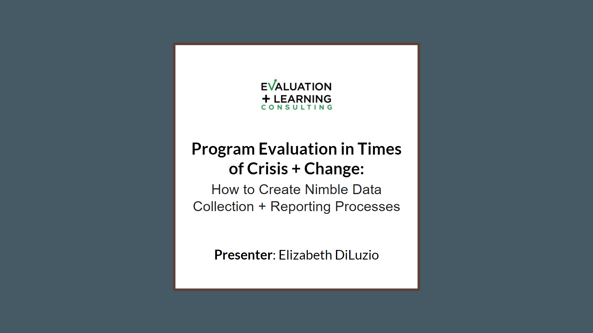</a>

---

### About Data Umbrella

Hey everybody! Welcome to Data Umbrella's webinar! Thanks for joining us. I'm going to go over a brief introduction about Data Umbrella and then Liz is going to do her talk. For the Q&A - for the questions, you can feel free to post them in the chat or in the Q&A tab and I'll sort of moderate the session and ask the questions as I can, you know find a good place to interrupt Liz as she's presenting. Now, this webinar will be is being recorded actually.

A little bit about me, I am a Statistician and Data Scientist I am based in New York City. I am the founder of Data Umbrella and I'm also an organizer for the New York City chapter of PyLadies. You can find me on twitter with @reshamas and I'm also on Github and Linkedin with the same username.

At Data Umbrella, our mission is to provide a welcoming and educational space for underrepresented persons in the field of Data Science and Machine Learning and we are a volunteer-run organization. You can find us on Twitter at Data Umbrella.

PyLadies is a group for gender minorities really of all levels of programming experience. I have included the link to our home page if you want to go to the global page, it's PyLadies.com and you can follow us on Twitter as well.

I want to go over the code of conduct. We're dedicated to providing a harassment-free experience for everyone. We ask of you, our participants to be professional and respectful. This also applies to whatever questions are posted in the chat whether in the communal chat or private DM's and we want to thank you for making this a welcoming, friendly community for everyone.

On the Data Umbrella website, there are a bunch of resources that I have compiled about open source conferences about learning Python and R as well as accessibility communities, inclusive language, responsibility, and allyship. There's a lot of great resources and so I encourage you to check it out.

We have upcoming webinars: we do about two webinars a month, and so the best place to find out about upcoming events is on our Meetup page. We also do share it on our Twitter as well. On Linkedin is where there are job postings and also there's a Linkedin page where I share resources. Youtube is where all of our webinars are recorded and uploaded so you can subscribe to our Youtube channel so you get notifications.
So now I'm going to turn over the screen I guess to Liz and I actually work together in New York. We teach intro to our stats classes in New York and that's how I know Liz. So I'm really excited to see her online it's been a while and also really excited to hear about this talk.

### Intro

Sure, thank you Reshama. Hello everybody, let me just share my screen really quickly. All right, so as Reshama has said my name is Elizabeth Deluzio and I'm here today to just talk to you a little bit about my area of specialty, my area of passion, which is program evaluation. In particular program evaluation in times of crisis and change. So for sure, we're in one of those moments but I do think that even beyond Covid and our Covid era however long it lasts, the skills that it takes to have really responsive data and data feedback for data-driven decision-making, I think is something that's needed all of the time, no matter what time period we're in. So I think these things can span in importance.

So just a little bit about me before I begin talking about those things. If you're not familiar with what program evaluation is, I think of it as applied research. It's research that's for a purpose and particularly helps programs run more efficiently, run just more intelligently, and to learn from the work that they're doing. I have been working with non-profits, governments, and foundations for over 15 years. I started off as an eighth-grade teacher. I taught eighth grade for six years and I always say that you know if I can teach eighth graders, I can teach anybody and so today not only do I do work in evaluation, I teach these types of tools and data literacy skills in general.

I have an MPH and an MSW, so I in terms of jobs that I do, I work in internal evaluation for a non-profit in New York City called Good Shepherd Services and we serve children, youth, and families, about 30,000 per year. I teach quantitative methods at NYU, I have been doing that for about a year now. And then I'm a facilitator at evaluation and learning consulting and so that's who I'm speaking from and who I'm representing today. And so when it comes to evaluation and learning consulting, they do consulting work that is specifically around evaluation work, around strategy, and building that work for non-profits and governments. That's me and just in terms of what I hope for you to get from today.

### Goals for this Talk [(6:08)](https://youtu.be/LZuJlZIDIbo?t=368)
<a href="https://youtu.be/LZuJlZIDIbo?t=368" target="_blank">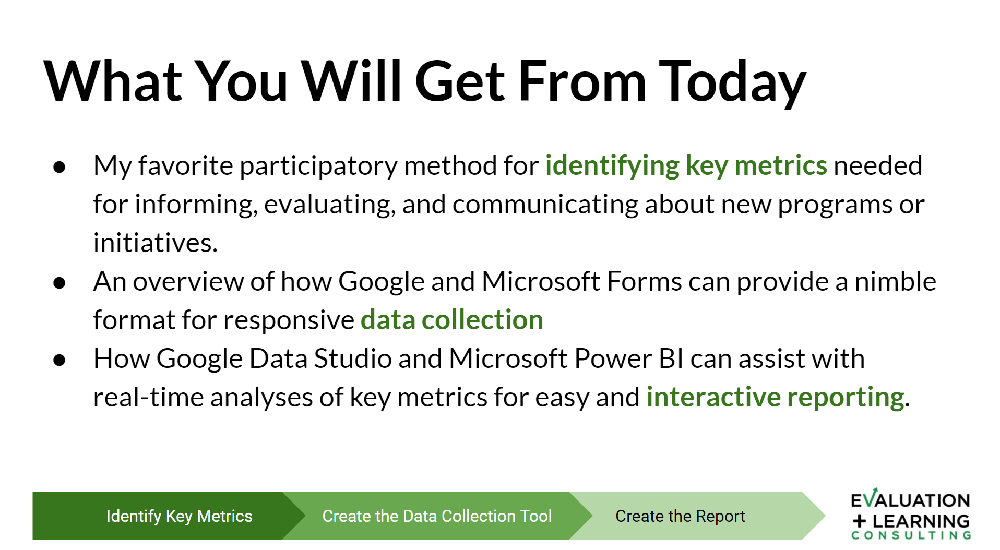</a>

So three different goals for you: the first one is my favorite participatory method for identifying key metrics, so if you're going through the program evaluation cycle the first thing that needs to happen is okay we want to assess how we're doing, we want to assess the impact that we're having, and that first step is, okay well, how will we measure that. So I have a method that I like to use. It is participatory in order to get as much feedback as possible about what is the best way of measuring x, y, and z.

So then from there, once we have a way of measuring it now we move into this data collection and I have a specific tool that I want to share with you that I like a lot which is forms and it's very similar between Google and Microsoft but either way this is how we collect the data. So we've identified how we want to measure, what it is that we want to measure, and then we can create this data collection tool. I'll explain to you why this is where I tend to go if I need to collect data.

Then once it comes to the reporting phase how do we get that information in the hands of decision-makers quickly my go-to tool is Google Data Studio, which is what I want to show you today and Microsoft Power Bi is the Microsoft version of that. But either of those help with real-time analyses, so gone are the days of printing out reports and making sure it gets emailed or handed to somebody. This allows somebody to have the report in front of them - real-time data and they can interact with it, which is an extremely powerful tool.

So again I'm going to go through each of these phases too, but basically, I want to take you, in less than an hour, from the beginning stages of - how do I even think about what it is that I want to measure, to how do I collect that data, and how do I report on that data, and what are the tools that can help me to get there.

So before I begin, I just want to get a feel from you about what brought you here. So I have a poll that I want to activate right now. Hopefully that pops up on the screen in front of you. So just curious what brought you here? Of those three things, which one interests you? This will kind of help me to figure out what to spend more time on than others, customize what I'm doing a little bit.

### Poll of Topics to Focus on for the Talk [(8:04)](https://youtu.be/LZuJlZIDIbo?t=484)
<a href="https://youtu.be/LZuJlZIDIbo?t=484" target="_blank">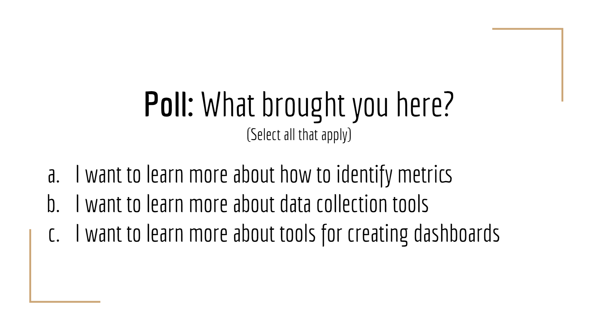</a>

I'm not sure if you can see the results, but if you can't, it looks like we've got… oh people are still voting. A and B are neck-to-neck and then, C just caught up though. All right so you all are just interested in everything! It looks like it's a tie for A and B with 14 votes and then C got 10 votes. So that's great. Thank you. Appreciate the feedback. And I will distribute my time evenly as Reshama said, if you have any questions as I'm going through, I'm going to go through each of the three phases. I'll stop in between for questions but as they come up, type them in the chat box and if Reshama you know, just speaks up and inserts them into what I'm saying, that's great and otherwise we can wait for those question sections to just make sure that your questions get answered.

### Identifying Key Metrics, What are we Identifying? [(9:31)](https://youtu.be/LZuJlZIDIbo?t=571)
<a href="https://youtu.be/LZuJlZIDIbo?t=571" target="_blank">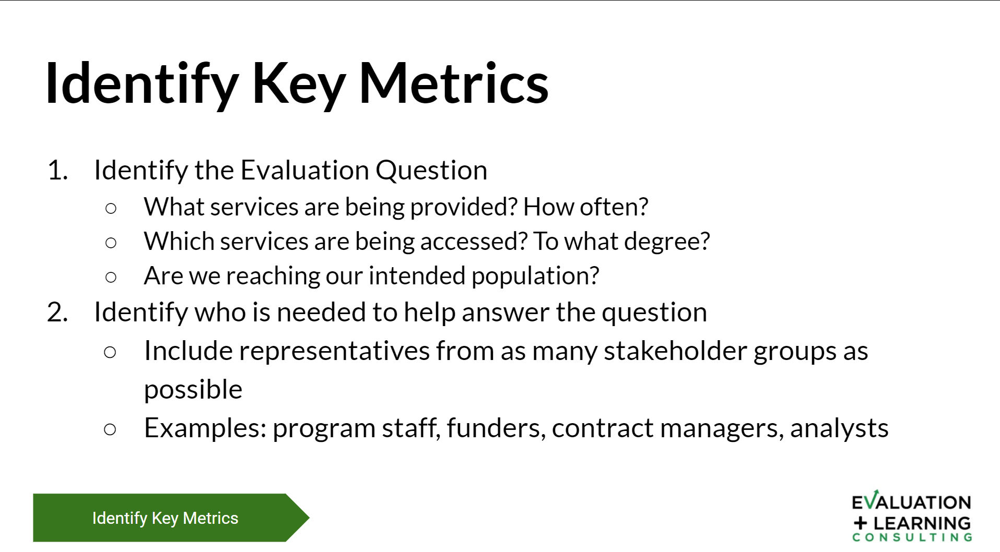</a>

So, when it comes to identifying key metrics then there's a stage process that I go through. It's a short one and I do try to make sure that, one, I don't take too much time. These things could take, you know, months but that's not the goal. The goal is to get things done quickly and then, I really work through an iterative process. So we do something. We start collecting because it's important to begin. And then we can tweak along the way.

So the first step is just to identify the evaluation question. What is the question that we want to answer? Examples could be: what services are we providing right now? We think we know. We told the funder that we'd be doing x, y and z but what are we actually doing? And then how often, are we doing what we're doing?

Another question, or set of questions could be: which services are actually being accessed? So we have these wide array of services. What are people actually accessing and then to what degree?

Thank you for sticking with us. Okay, so just to go back. I'm not sure where I lost you all, however, just to run really quickly through this slide again: so in terms of identifying key metrics, there's the evaluation questions that we want to figure out: exactly what it is that we want to know. So once we know what it is that we want to know - some examples could be: What services are being provided? What's being accessed? Who is accessing them?

Then we move into: Who do we need in order to answer this question? - in order to figure out what our metrics will be to measure and figure out the answer to the question. And so some examples of people who we might want to invite into this event - it'll be a couple hour meeting would be programs, staff, funders, contract, managers, analysts, it could be maintenance folks, or people who work at the front desk of the program that's being offered. Be creative! The more people, the better in my opinion. So the more minds you have on this, the better chances you are in figuring out the metrics that are appropriate for answering this question.

Liz: So once this...
Reshama: Sorry I just wanted - is your mic the same as it was before?
Liz: I think so. Okay you can test that. Okay let's give this a try.

### Identify Key Metrics [(12:24)](https://youtu.be/LZuJlZIDIbo?t=744)
<a href="https://youtu.be/LZuJlZIDIbo?t=744" target="_blank">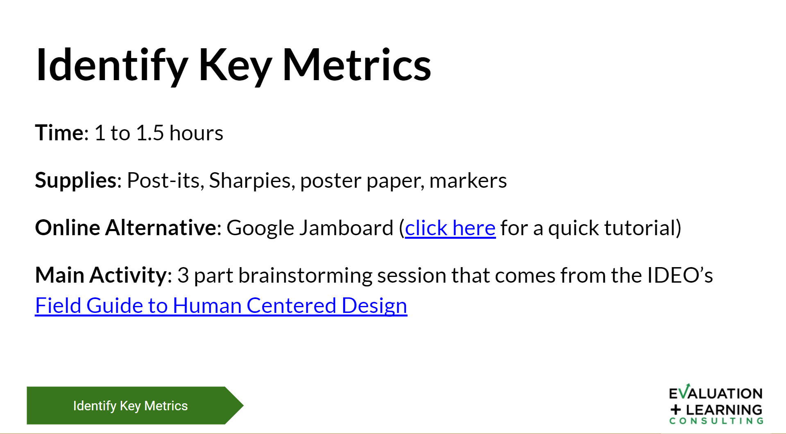</a>

Markers -  those are the tools that you want with you. If you're doing it online, which it looks like for a little while, at least that's what we'll be doing - there is an online alternative called Google Jamboard. If you are not familiar with what that is, I did record a really quick tutorial on Google Jamboard. There's a hyperlink [here ](https://www.youtube.com/watch?v=U5pZDwTzcIk&feature=youtu.be) and I will send out the link to these slides afterwards or I'll ask Reshama so you have that. But Google Jamboard is a free online resource I can demo it if we have some time at the end and essentially it has Post-its where it's a big board people can add Post-its, move Post-its, around annotate, and so on. It simulates this environment of a Post-it-type meeting.

And then when it comes to the main activity, what we're calling people together to do-is a three-part brainstorming session. And it comes from IDO's field guide to human-centered design. So this is based in human-centered design and again, this participatory approach that they highlight.

### Identifying Key Metrics: Steps [(13:30)](https://youtu.be/LZuJlZIDIbo?t=810)
<a href="https://youtu.be/LZuJlZIDIbo?t=810" target="_blank">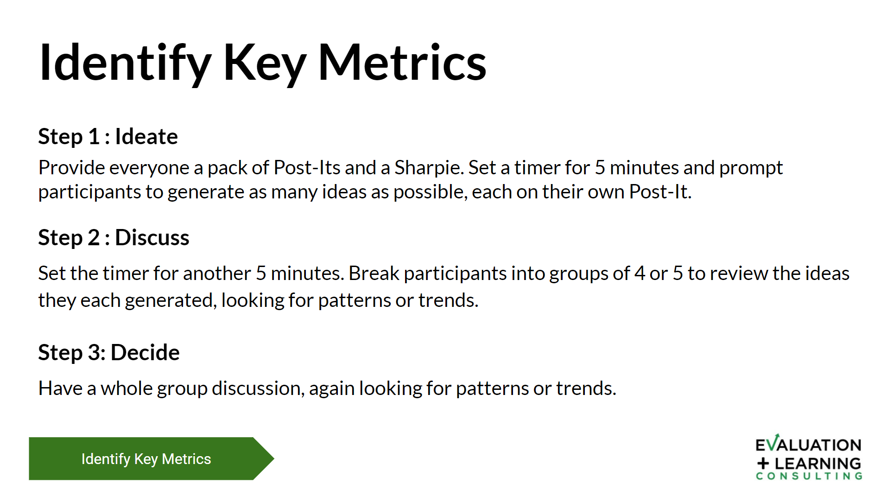</a>

So number one, the first step is to ideate. We provide everybody a stack of Post-its. If we're doing it online, we just ask people to write that down on their computer or on a piece of paper in front of them. We set a timer for five minutes, and we prompt them to generate as many ideas as possible. So we're going back to this question of - if our question is what services are being accessed and to what degree, we will ask people okay well if we were going to measure something like that what are some questions that we would want to have answered, or what are some data points that we would want to make sure that we're collecting? So we would give everyone five minutes to just brainstorm on their own.

After that, we move into a discussion phase where we have another five minutes set up, and we group people into small groups. Again if it's in person, it's about groups of three to four if it's online, I often use Zoom so I can have folks break out into breakout rooms of three or four people. And that's when I move them into Google Jamboards and that's when I have folks share their ideas and they're looking for similarities, they're looking for themes. So if they have the exact same idea we might have them write a couple of Post-its and stack them up if they're starting to see themes they might want to cluster them together, they might want to change the color of the Post-its to all be one certain color. And again, we're just kind of starting to generate the group's opinion on what those metrics are that we want to be collecting.

And then the final stage is to come back together as a whole group and this is where we share, if I was in person, what I would do is just ask folks, okay, what was one of the more popular metrics that you thought in your group that needed to be collected? I would collect their Post-its I would ask the rest of the room who else had this idea I would collect all those Post-its and I would stick them up on that big piece of poster paper and I would continue in this way for again another five-to-ten minutes. And I'll make sure it's timed just that way. The best ideas, the most popular ideas will come to the surface during that shortened period of time. And I am again looking for trends, looking for similarities, looking for what it is that the group is in general saying. And the reason that I like this pattern, again it's consolidated - we really make sure we stick to those that time period - because these types of meetings and again coming up with just metrics can take a really long time if we let it. But what's important is making sure that we begin. And so again making sure that we have many people in the room many voices, many perspectives, we give each person their own time on their own so that you know, the the person with the highest credentialing in the room, or the person with the most power, the highest position, is not the one whose voice makes all the decisions. Everyone gets a chance to come up with their own thoughts, collect them, and then everybody - you have your Post-its, so everybody is able to share what their ideas are and each idea counts equally. And then that's how we cultivate where those metrics are all together. So that's that in a nutshell.

Do we have any questions, Reshama, from the group, just about that technique? There's so much more I could say about it.

Reshama: Okay, I don't see any questions in the chat.

Liz: Okay so there's so much more that could be said and you're more than welcome to reach out if you have any questions about it, but that's in general the method that I use to come up with what those metrics are.

So once I have those metrics, it's time to create this data collection tool. And then, let's do another really quick poll because I'm curious what it is that you use so when you're working, whether you have a job or whether you do consulting. Do you typically use Google, Microsoft, both or neither?

Okay, great so I'm seeing a majority Google which is great. I'm seeing... So that's six people at Google, two Microsoft, three both and two neither. So Google wins this round, which is actually really great to see. Oh, I see more of both coming in. Great, okay in the chat I'm just curious about those who use neither, or if you use something else, please feel free to share. It's also just a really great opportunity for all of us to learn from each other. So that's good to know, just to understand where you're coming from.

### Introduction to Forms [(18:22)](https://youtu.be/LZuJlZIDIbo?t=1102)
<a href="https://youtu.be/LZuJlZIDIbo?t=1102" target="_blank">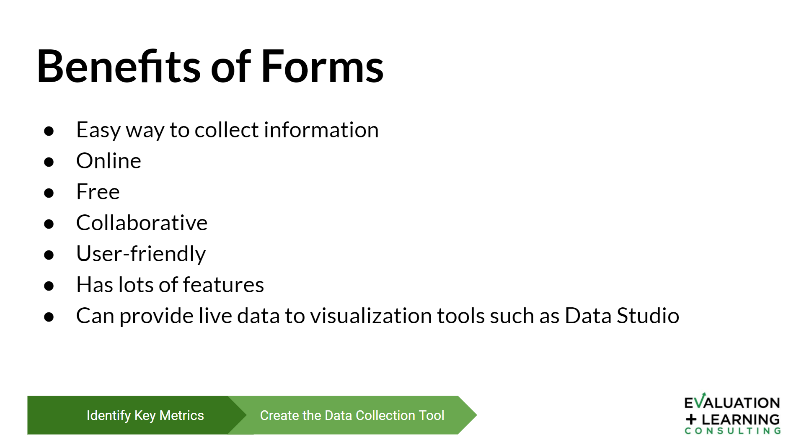</a>

As I shared a little bit at the beginning, I tend towards forms if I can. And here's the reasons why I use forms - because it's an easy way to collect data, it's online, it's free, it's collaborative, so many people can get in and edit it at the same time. I think it's extremely intuitive, it's very user-friendly, it has a lot of features, it can do the basics for sure. And then why I use this in particular is, if in the end, I know that my audience, my decision makers who need this data, are friendly to online live visualization tools, so if they're familiar with dashboards and true dashboards, then I try my hardest to make sure that I use forms whether it's Google Forms or Microsoft Forms so that it can feed into that live dashboard. And if that doesn't quite make sense I'll explain more, and I'll show you what I'm talking about. But there are some drawbacks and I think that's worth noting.

### Drawbacks of Forms [(19:22)](https://youtu.be/LZuJlZIDIbo?t=1162)
<a href="https://youtu.be/LZuJlZIDIbo?t=1162" target="_blank">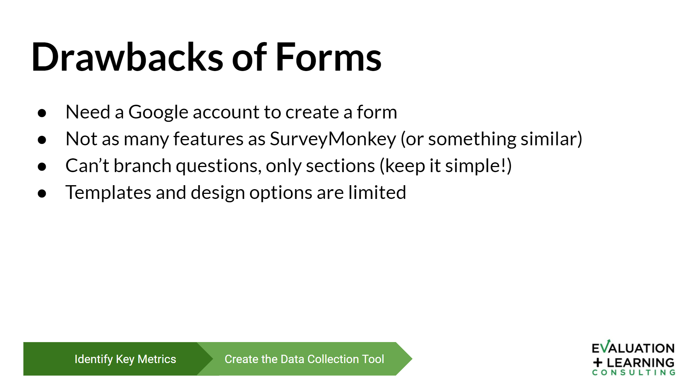</a>

So again, I really believe there's no one solution for everything, it's just for those of you who use both. Right? It's understanding what the needs are, to figure out what the tool is that's best for what you want to do. So there are some drawbacks to keep in mind. One of them is that you need a Google account to create a form. Honestly that's not a huge drawback, but if you're not into signing up for anything new, or trying to remember a new password, that might be a deterrent. Google accounts are free for those of you who are not familiar with what I will say, a true drawback is that there are not as many features compared to something like SurveyMonkey. So if you're looking for something that has a really one, polished look to it or two, has pretty advanced features you won't find it in forms. It's a basic go-to.

It cannot branch questions, only sections so that's worth noting. Whereas, in SurveyMonkey, you know, if you answer A, jump to question 9, if you answer B jump to question 13. That is not the case for either forms - Microsoft or Google. What you do need to do instead is branch sections, and I'll show you what that means. So it has to be a little bit more simple. One thing I particularly don't like is that the templates and design options are pretty limited, so again it's a really basic thing. It's not going to be completely customizable so just really quickly, I'll show you what I'm talking about.

### Google Forms Demo [(20:52)](https://youtu.be/LZuJlZIDIbo?t=1252)
<a href="https://youtu.be/LZuJlZIDIbo?t=1252" target="_blank">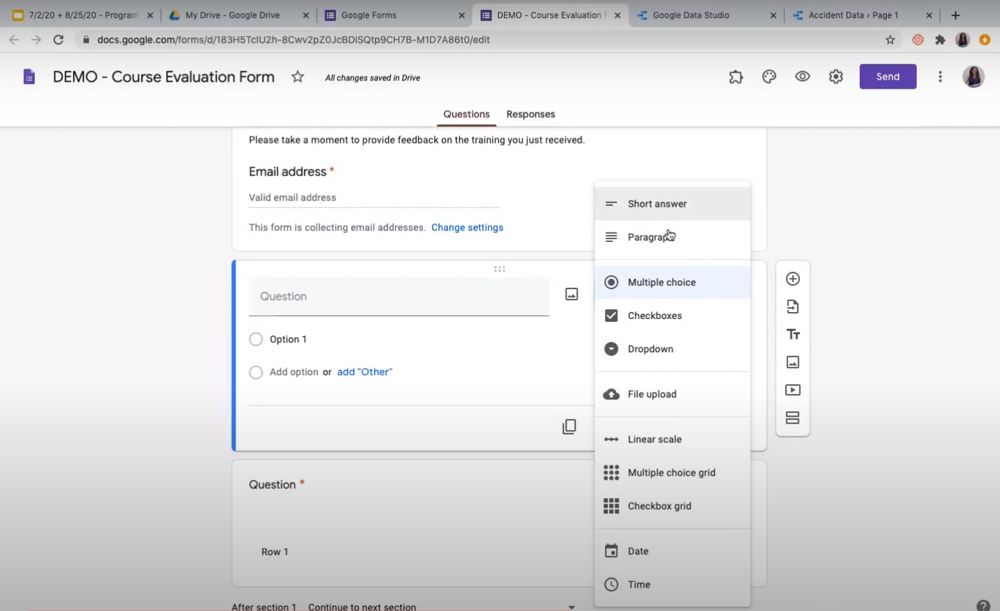</a>

So if you do have a Google account, or when you sign up for your Google account, there's something called the Drive so that's drive.google.com so you can see My Drive here. The menu for all the Google apps is right up here, in the top right hand corner. And so you can see all of the different features here. One thing I will point out is Jamboards are here. So it's hidden there and I didn't even know I don't know how long it's been around. I only learned about it maybe four months ago, and I love it. It has spread like wildfire among me and my peers but that's there for you to play around with.

And then Forms is also here and I think, yep, it's on the same line so, if you click on forms it will take you to the landing page of Google Forms. This is what that looks like. Up here you can see some templates. And then down here you can see forms that I myself have created.

So I'll show you a demo form that I just use exactly for purposes like this, so let's say that this is an evaluation form. You can see, you know the basics around these sections that I was talking about. You create sections and questions here in the toolbar here's how you add a section, here's how you add questions. Each of your sections can be their own page. So I just like to think of it when you're chunking the questions maybe by theme or by complexity of the question itself.

When it comes to adding questions, there are so many options which I think are really excellent. So for more qualitative questions you have short answers and paragraph options. For more quant, you have multiple choice checkboxes drop down menus, you know I have created forms for HR departments and sometimes they need documentation uploaded. There is a file upload which is incredible and it can put it right in your drive which is the first place that we looked. So it'll go right in there and it'll keep it all in one folder for you.

Linear scale, so that's your Likert scale, you can do that multiple choice grids, and checkbox grids, and then we have date and time options. There's lots of different features and it's pretty intuitive in how you enter your questions. So questions go here, the options all go here, you can make the question required if you like or it can be optional. A lot of customization that can take place. Once you create your questions and your sections, you can just click and drag to move things around and then, you know there's some features up here you can change what it looks, like you can change this header image, you can change your color scheme there really is a lot that you can do with just this free version of forms.

And then you can preview it, so you click on that button and you can play around to see how it looks. You can see as I said, each section becomes its own page which is nice for chunking - to not have people get fatigued when completing your survey.

And then in particular, when it comes to pulling out the data, there's this tab here for responses, and you can see there are no responses yet. But what it will do is create a summary - an aggregation of the responses that you get for each of the questions. And then if you want to do your own analysis you can click on this button here, create a spreadsheet and that will allow you to download a spreadsheet or open it up in Google Forms, sorry Google sheets, and do your own analysis and create your own reports.

And so as I said you could just end there, and you can do whatever reporting it is that you like to do. What I love about this, particularly, if you open it in Google Sheets is that that sheet now becomes live, so any time that somebody enters a new form and they complete it, they submit it, adds a new line, a new row, into your sheet. And so anytime you go back there, it's got you can see updated information being put in immediately, which I think is just really helpful.

And so why in particular that's helpful is this idea of live dashboarding. So I'm just going to pause here before I segue into live dashboarding and just see if anybody has any questions. Again this is a really quick overview of forms, so if you have any questions about what this is, what it looks like, how to do something, please feel free to ask.

Reshama: There was a question from about can you provide an example where you did the key metrics identification. How was its reception? Maybe you might want to answer that at the end of the presentation since we're passing that out.

Liz: Sure, I can do that. Any other questions about the data collection tool?

Reshama: I don't see any other questions.

Liz: Okay, and you know, I might as well just answer.

When it comes to the key metrics, I, that is my go-to. I teach these methods to people so they can go out and do it themselves and it is my go-to whenever I'm helping folks create an evaluation system.

I can't say that I have ever had a bad reception to it, although I can imagine there's some anxiety that people hide because they need to be involved. Right? Like often we come to meetings, and we expect to just be talked to and people to do the work for you, especially as a consultant coming in, they often expect me to just come up with everything. And so there is the conversation of it really it's an honoring of - you have the knowledge I'm just helping to facilitate and pull all of that out. And so in that space, I always ask for line-level staff to be involved. So they're not necessarily the one who pulled me into this program to do the work but now they're involved and engaged in it. And quite honestly I think they love it, I find that people really get into these conversations, because we're talking about things that they're passionate about. This is their job. This is their life work. And so to be able to have me ask them questions and truly treat them as the expert, because they are the expert in their content, then I find that there's a really hearty conversation. I almost get overwhelmed with how much information I receive and need to sift through and find some solutions too. So I find it goes over very well. Please feel free to ask follow-up questions so that if you want to know more, and, or if I didn't answer your question as you hoped.

### Intro to Dashboarding

Okay so then let me jump into dashboarding and what that looks like. And so I'll just start by just a quick note about automation, because if anybody's even tried to automate anything whether it's you know live dashboarding or something completely different, you know that this it can go very well, and it can also not go very well. And so you know I love this cartoon that just kind of demonstrates what not very well can look like.

<a href="https://www.youtube.com/redirect?redir_token=QUFFLUhqbFNvcTBBMzFtdDlMeWV5czRBX09mWEVKQ0Jrd3xBQ3Jtc0tsLUt1eTdPM3FRZkFjd2dxSHFqai1MOHVWOWd3NUhOMWF5RlAxQ3JJMlNjSzl3WjItSUdZMzVMbzd4LWtqQ0t1V1RWOWJldVNrTi1ORUFWVVlIaUpXSWtlQXoxd3VEMVVNZVA3ZTh2b0NHcGZDSHlHSQ%3D%3D&v=LZuJlZIDIbo&q=https%3A%2F%2Fdocs.google.com%2Fpresentation%2Fd%2F18jJUHA5KtWWTM9cRweLAccG8MZGctfZjtiI7AYoCAXg%2Fedit%3Fusp%3Dsharing&event=video_description">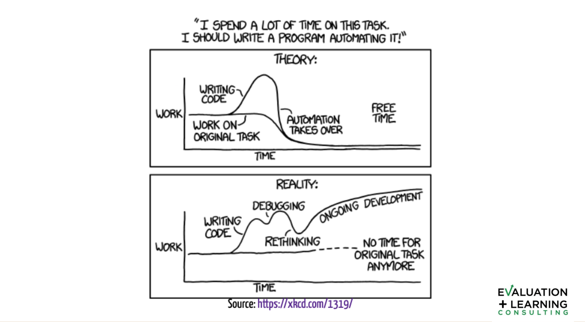</a>

Which is: Hey you know this quote I spent a lot of time on this task I should write a program to automate it. And at the top is what we imagine our life is going to be like, right? So we have our level of work which is right in the middle, we know there's going to be an uptick when it comes to writing the code or creating this automation, but then once the automation kicks in, we're going to have all of the spare time to do all these other amazing things to enrich ourselves to professionally develop, and then often, if not really thought through, or it doesn't have the support it needs, what can happen is what's down below: which is we have that that level of work we write our code, but then we need to debug, and then we need to rethink, and then we have ongoing development, and updates and upgrades, and it turns out that you no longer have the time. In fact you feel more overwhelmed than you did when you began.

And so, I say this not to scare and not to scare you away from automation for sure, but I do say, make your decisions with eyes wide open. And so as I have said, I have tried automation that has not worked and then I have done automation that has truly saved me so much time and in fact, that automation did take the form of forms. Into... For me it was for an organization that uses Microsoft so it was Microsoft Forums to Microsoft Power BI. And it saved me an infinite amount of time and folks, truly! Like it is collaborative, it is everything that I'm telling you. And it has worked tremendously.

### What is a Dashboard [(29:57)](https://youtu.be/LZuJlZIDIbo?t=1797)

So, when it comes to dashboarding, I also like to just clarify what I mean by dashboarding, because I think that term gets used loosely, and is not always true to what dashboarding is. So dashboarding is a tool, and it contains real-time information. And that information is directed towards decision-makers that are equipped with what they need in order to make decisions. It is directly connected to one or more databases. It automatically updates itself, and the information is shared via visualizations. So sometimes people will call a printed out report a dashboard. That is not a true dashboard. It really is this real time information that people have access to.

### Intro to Dashboarding [(30:39)](https://youtu.be/LZuJlZIDIbo?t=1839)
<a href="https://youtu.be/LZuJlZIDIbo?t=1839" target="_blank">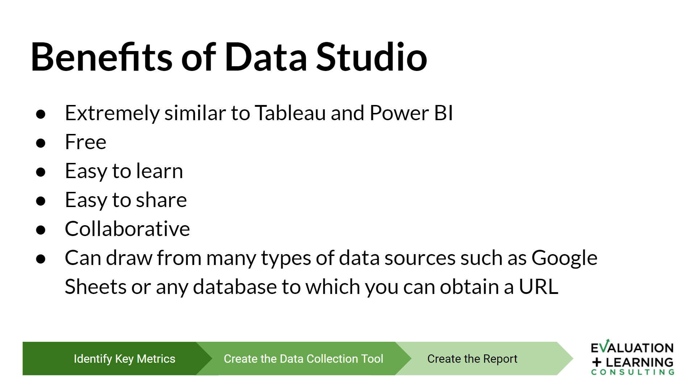</a>

So when it comes to creating interactive dashboards, when it comes to Google, if you're using Google, that is called Data Studio and if you're using Microsoft it's called Microsoft Power BI. And what I love about Data Studio in particular is that it is extremely similar to Tableau and Power BI. Tableau being one of the more famous, more popular data visualization tools. I would say that if you know how to use one you know how to use the other. I have worked in all three and they are extremely similar interfaces.

So I think that's a great option, and I always encourage people that if dashboarding is the way that you want to go, if you either one are dashboarding already with folks, or that's in a place that you want to take your organization or your clients, that I would always recommend starting with Google Data Studio just because it's free before you make this financial investment in one of these other two things. I encourage you to start with Google if at all possible, mostly because it's free and it gives you the opportunity to bail out if you if it's not working for whatever reason. So free being another highlight. I do believe it is easy to learn. I think there is a learning curve.

I think it is generally intuitive, so I say that. I think it's extremely easy to share, you can share, not only can you create pdfs if you want to, I think that beats the point, but if you need to archive a certain amount of data for a certain day, you can download pdfs and save them, or email them out, but you can also send a link so that folks can just see the live data at any time. You can also - it has the html code so that you can insert it into a web page or somewhere else. It is collaborative, just like any Google platform, and it can draw from many types of data sources which I think are really powerful tools also. So it can pull from Google sheets, as I shared already, but it can also pull from any database where you can obtain a url and so it's very powerful in that regard. It can pull from SQL databases as well.

### Drawbacks of Data Studio [(32:53)](https://youtu.be/LZuJlZIDIbo?t=1973)
<a href="https://youtu.be/LZuJlZIDIbo?t=1973" target="_blank">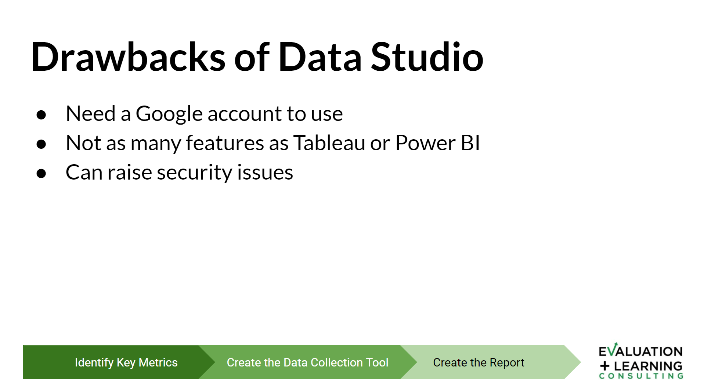</a>

There are some drawbacks though of course again this is what I was speaking to, when making your decisions with eyes wide open. You need a Google account to use. I should just get rid of that bullet, I think that's silly, but it's worth knowing you need to make a Google account. It does not have as many features as Tableau or Power BI, so again, I don't think it's not fair to call it training wheels, because it is its own true full system. But I often think of it as training wheels. You start with Google Data Studio I encourage folks to, and then if you need more features, that might be the time to invest in Tableau or Power BI but I have seen organizations stick with Google Data Studio for all of their needs for extended periods of time and you don't necessarily need to upgrade.

It can vary with security issues and that's worth noting if you have any sort of private data, you want to make sure that you de-identify before you start putting anything in Google. And I always recommend that folks just speak to the IT department of whatever organization you're working with, to make sure that they don't have a hard and fast no Google policy, and see if they have any recommendations on how to keep the data more secure.

And actually I do think somebody told me that if you have a paid version of Google, so for the company actually uses Google as their platform, then it is within the firewall often of an organization, so that too is worth knowing.

### Demo of Google Data Studio [(34:22)](https://youtu.be/LZuJlZIDIbo?t=2062)
<a href="https://youtu.be/LZuJlZIDIbo?t=2062" target="_blank">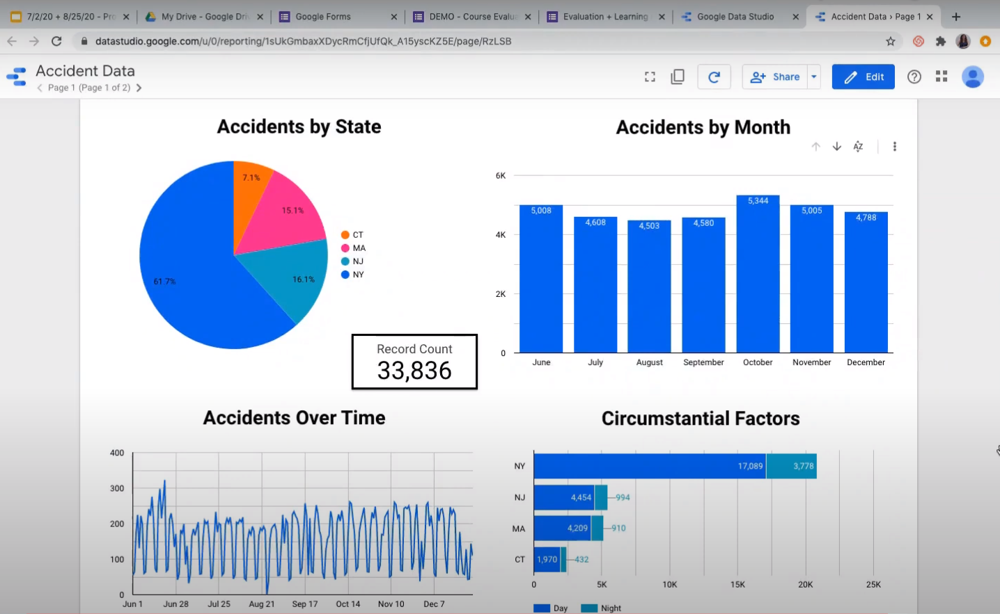</a>

So a really quick demo for you. So unfortunately and I have a feeling I know why, but I won't go into the history lesson. In your Drive there is not an app for Google Data Studio and so you would just need to type into your toolbar datastudio.google.com and again this is free. If you have a Google account, you have Data Studio. So this is what this home page looks like, it's very similar to Google forms. So you see some templates up here, and then you can see a couple of reports that I had created here. So I just want to look at the accident data with you. So what this is is accident data for the northeast United States and it was for I think July to December of 2019.

This is just open data that's out there on the web. And I had created a dashboard just to demo what the different features are so you can see it looks beautiful. It really can have a very professional appearance to it. This is what folks would look at if they clicked into your dashboard. So you can see five different tools just here, we have the ability to make pie charts, we have the ability to make bar charts, line graphs, and then over here, too we have, so stacked bars are here. And then just a single number. So you can see our record count, the number of accidents from July to December in these four states was almost 34,000. And then if we the reason that this is so powerful and that I love using live dashboards so much is that, if we had somebody who wanted to dig down and understand more, so say they wanted to understand what the monthly breakdown of accidents are for New York only, it's as simple as clicking on the pie slice for New York City and then pausing and waiting and you can see when I hover over it there are 20,000, almost 21,000 accidents that took place so of the 34 21, occurred in New York City or New York state alone. Now there are a lot of pieces of data, so it takes a moment to think about.

But what you'll see as soon as it's done, is that these bars will all adjust to show New York City only. It's filtering right now. So it's going into the spreadsheet. It's finding only the New York City and New York state accidents and it's pulling out that data that's related to it for these other categories. So now we can see which, it looks like June had the most accidents followed by October and then closely followed by November. And we can see the change over time, and we can hover over and see exact details so this is the interactive piece that I'm speaking to. And you can click on multiple pies at the same time. I can drill down further so if I wanted to look at New York in June, I could do that, the story goes on and on.

You can also drill down, so you can see here, circumstantial factors. This is broken down - accidents that happened during the day, and those that happened at night. And if I wanted to dig deeper, so underneath that, is okay, well I want to understand the morning hours, versus full daytime, versus evening, versus sunset, you can click on, say the day bar, and it'll show you a breakdown of more specific time periods during daytime hours. And so that's called drill-down versus filtering, which is what I did up here.

So there's that, and then the other thing that I love to show, and it might take a moment to load, but there are lots of features I'll show you just the back end of how to develop this really quickly. But what we have here is the ability to create a map also, and it is so easy, so those of you who really respect and understand how challenging it can be to develop a map, not so much when you're working with Data Studio, it's as easy as dropping in an app. And you can see here now, what a story this tells when we're looking at accident data you can tell where the major highways are, it's so clear and New York City is clearly a hot spot as are the what is that one the turnpike and the parkway, no this one's the turnpike, that one's the parkway coming out in New Jersey, Boston area, is a hot spot. So anyway, that's the data visually. Now if I wanted to show you the back-end really quickly, I'm going to click on edit again. It might just take a moment to load, and again if any of you are familiar with Tableau, or you're familiar with Power BI, this is going to look so familiar to you. They worked very hard to make sure that it's a very interactive platform. It has a lot of drag and drop features.

Just going to go back to page one really quickly, and just show you, so up here is the main command area, when you begin, you start with just a blank, a blank screen, and you would select add data. So the very first thing is obviously, you need to get your data. Here's the option for Google Sheets and what happens is, you'll click on that. It will take you to your Drive, and you'll just find that sheet that is the output from your Google Forms. Once you have it connected, the two are connected forever. I think this updates every 15 minutes, so anytime a new form is put in within 15 minutes, this data will be reflecting that information. And then once you've got your data connected and again you can connect multiple datasets at the same time, there's this add-chart feature. And you can see how many visualization options there are. I have shown you most of them, but there are more. So you can insert just a general table if you think that that's the most valuable way to share information, sometimes it is. You can do donut charts, you can do different types of line charts, and area charts, scatter plots, tree maps, which is a personal favorite of mine. So there are lots of options. And then once you decide, let's say you wanted to do a pie chart, let's say this was the one that I was working on. This is where we edit it, and make it look the way that we want it to.

So this list of available fields are all of the columns inside of my dataset from the accident data. And it's as simple as taking whatever it is that you want to visualize, so let's say we wanted to create this accident by states, I would just find the state down here, and I click and drag it into the dimension. And then when it comes to metric that's just asking you how it is quantified. So we'll represent the states, but how do you want me to quantify that? And then, that is through the record counts - I want to know the number of accidents for each of those states, and so again I would find record count. And I would insert it here. You can do lots of things after you have done the basics. So you can find a different sorting method if you don't like the way it's sorted. And then the style is where we make this look really professional. So once you've got the chart with the information that you wanted to have, you can come in here, you can change the number of pie slices, you can change the coloring, you can add your data labels, you can change the size of your font, the font type, the the font color, you can just go on, and on and it's the same for all of these charts. And so you know, all of these things that you see here from the month the way it's spelled out that's not the way it is in the data set, I wrote over my data labels here, you can specify where you want them located, it's just there's endless, maybe not endless, but a lot of possibilities about how you can make this look. So that you can get something that looks really professional and is something that folks are excited quite honestly to click into and explore.

So that's my spiel for this. Any questions for me about Data Studio? There's obviously so much more to say about it, but I just wanted to give you a little teaser. Any questions Reshama?

Reshama: I don't see any questions now.

Liz: okay great thank you.

Okay so, those are all the tools.

I see we have a couple of minutes left. I do just want to do a quick close out, and then I'll be here for questions, as long as you are. Just in terms of, you know, what we went over today, we talked about my favorite way of identifying key metrics, like how do we capture what it is that we need to measure in order to answer our question.

Then I went over forms which is my preferred way of collecting data and in particular if I want to have this interactive reporting platform and so that's Google Data Studio. So just some final thoughts and tips.

### Final Thoughts [(44:18)](https://youtu.be/LZuJlZIDIbo?t=2658)
<a href="https://youtu.be/LZuJlZIDIbo?t=2658" target="_blank">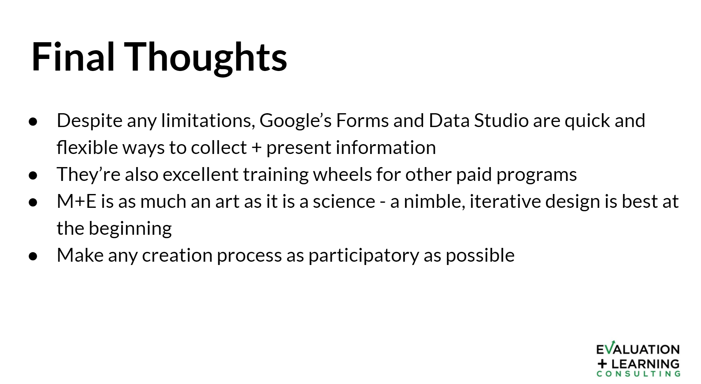</a>

Reshama: There's one question from Rose. Does the dashboard access work the same way as permissions to regular Google Drive apps?

Liz: If I understand your question correctly, Rose, yes it does, it interacts with everything on your Drive in just the same way. And if your question is about people and their permissions that is the same as well, so you can limit who can see what, who has access to edit, versus who has viewing access. But when it comes to pulling the data it needs to be within your Drive, or you need to have a hyperlink, to that SQL database, or that you know, other platforms database.

### Revisiting Today’s Learning Objectives [(43:49)](https://youtu.be/LZuJlZIDIbo?t=2629)
<a href="https://youtu.be/LZuJlZIDIbo?t=2629" target="_blank">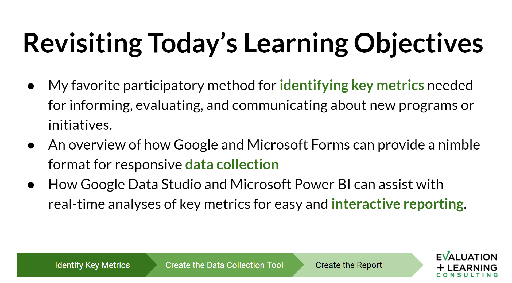</a>

So just in terms of you know final thoughts, words of advice,despite any types of limitations, I think that Google Forms and Data Studio are quick, they're flexible. As I have said, I have had tremendous success. I had to help organizations set up, just really quick just Covid data around who was being affected, and where, and when, and all sorts of things. And these platforms made everything so easy to communicate in real time.

They're excellent training wheels for other paid programs, as I went over, I do think that M&E is as much an art as it is a science. So we love to think of research and data and data analysis as so scientific and just 100 percent logical linear. But there's an art to it and anybody who is a true math person will admit that there is art too. And so with that in mind it is really important to have a nimble, and iterative design. So not something that takes months and months and months to develop and lots of money, only to find out that it's not working for you.

I really am an advocate of getting started getting something going for your most viable product right? Minimum viable product, and then going from there, and building on it from there.

Make any creation process as participatory as possible. I think that too helps to eliminate later down the road when you realize this is not working the way that we planned on it too. And then yeah, those are my big questions or pointers for you. And then just one more question for you. I just activated the poll - which is ,what do you want to learn more about? Is there anything you want to know more about? So identifying key evaluation metrics - there's so much more to talk about when it comes to that, data collection methodology and tools, creating interactive dashboards, other data related skills, and other evaluation related skills.

Good, so Reshama, this is good feedback for you too, for future webinars but it looks like creating interactive dashboards is winning with three votes, other data related skills is high too, oh, there's a three-way tie at the moment as well as identifying evaluation metrics, creating interactive dashboards. Okay, great so creating interactive dashboards is the most popular, followed very very closely by identifying evaluation metrics, and other data related skills, but somebody wants everything, so that's good to know too. So in terms of how I can help and would love to help with all of these things... I'm going to close this poll really quickly.

### Continue Your Learning [(48:13)](https://youtu.be/LZuJlZIDIbo?t=2893)
<a href="https://youtu.be/LZuJlZIDIbo?t=2893" target="_blank">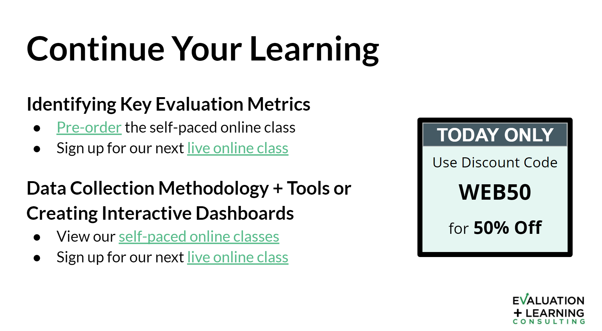</a>
[Pre-order](https://gum.co/data-driven-mindset)
[Live online class](http://www.evallearn.eventbrite.com)
[Self-paced online classes](https://gumroad.com/evallearn)
[live online class](http://www.evallearn.eventbrite.com)

In terms of continuing your learning, if it was identifying key evaluation metrics that are of interest to you, I do, so during this Covid time, I normally teach all these classes in person, particularly in the city of New York but I'm leveraging the internet. And this time I have to develop more. So as I said evaluation and consulting learning consulting is about teaching as well. And so we're developing self-paced online classes as I shared earlier it's micro learning. So we focus on having classes that are five to seven minutes long at most. And they're just little skills that we teach, and then the class just is just made up of that, so you can direct yourself, you can pick and choose what it is that you want to learn, and just move at your own pace.

So we're developing a class that we teach in person to be an online platform you can pre-order. And then we have live online classes too, so you can sign up for the next live one. Same thing goes for data collection, same thing goes for interactive dashboards. What I will say is we have both the data collection and interactive dashboards online already, and there's a safe self-paced version. And I have this discount code for people who attend our webinars as a way of just saying thank you and we want to empower you to learn more so.

If you use WEB50 it'll give you 50 percent off anything whether it's a live class or whether it's the self-paced model.

### Continue Your Learning - Additional Resources [(49:48)](https://youtu.be/LZuJlZIDIbo?t=2988)
<a href="https://youtu.be/LZuJlZIDIbo?t=2988" target="_blank">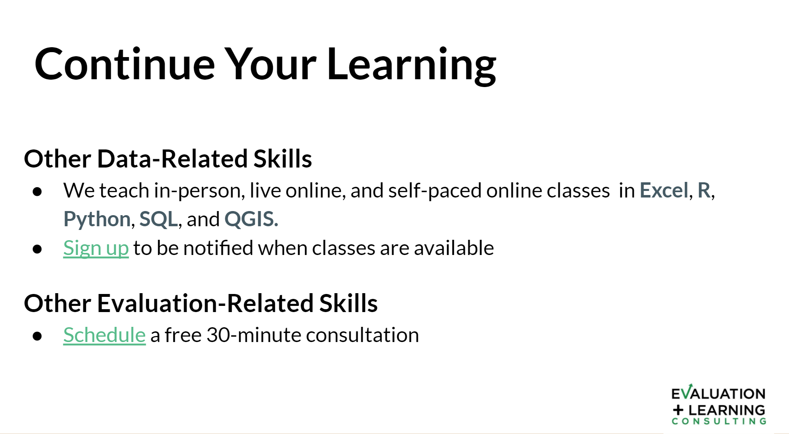</a>

[Sign up](https://mailchi.mp/1a602237bad6/newsletter-sign-up)
[Schedule](http://www.calendly.com/ediluzio/30)

So then when it comes to other data related skills as Reshama shared. We've met each other through teaching Excel, or I'm sorry R but we also teach Excel, Python, SQL, QGIS. So if you're interested in any of those let us know. We're creating that content again recorded and then we have live sessions periodically and then when it comes to other evaluation-related skills or really anything, if you just want to talk, I'm so happy if you can click on that hyperlink there to just look at my calendar find a good time that works for you. And we can just talk. I have had people who want to troubleshoot things who just want to know more about, you know, the way that I find key evaluation metrics, whatever it might be, I'm more than happy to have a conversation. And we can go from there, so please do that.

### Contact Information [(50:37)](https://youtu.be/LZuJlZIDIbo?t=3037)
<a href="https://youtu.be/LZuJlZIDIbo?t=3037" target="_blank">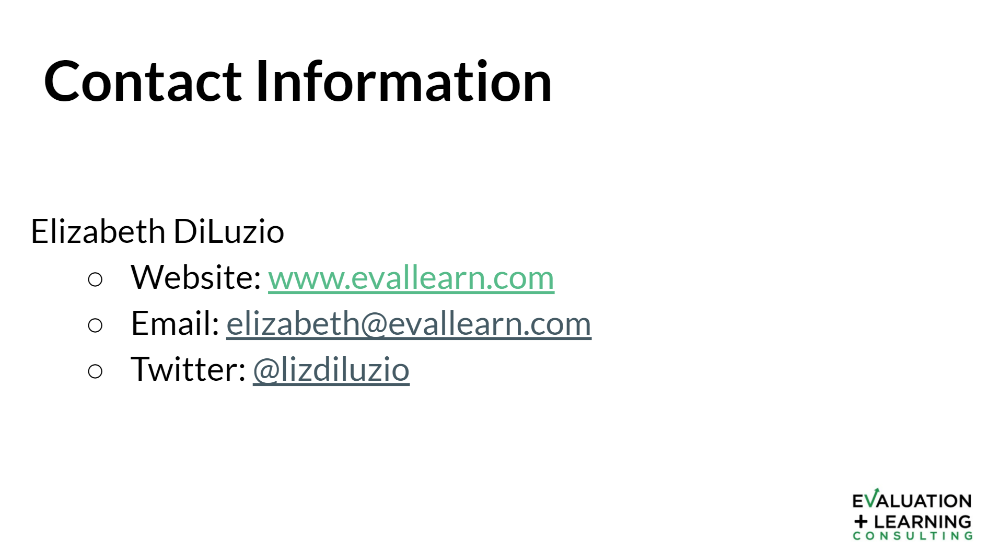</a>

Again I can ask Reshama to send out a link to this [powerpoint](https://www.youtube.com/redirect?redir_token=QUFFLUhqbFNvcTBBMzFtdDlMeWV5czRBX09mWEVKQ0Jrd3xBQ3Jtc0tsLUt1eTdPM3FRZkFjd2dxSHFqai1MOHVWOWd3NUhOMWF5RlAxQ3JJMlNjSzl3WjItSUdZMzVMbzd4LWtqQ0t1V1RWOWJldVNrTi1ORUFWVVlIaUpXSWtlQXoxd3VEMVVNZVA3ZTh2b0NHcGZDSHlHSQ%3D%3D&v=LZuJlZIDIbo&q=https%3A%2F%2Fdocs.google.com%2Fpresentation%2Fd%2F18jJUHA5KtWWTM9cRweLAccG8MZGctfZjtiI7AYoCAXg%2Fedit%3Fusp%3Dsharing&event=video_description) so you have all of these hyperlinks easily accessible to you and then just for me the the website is here it's [evallearn.com](evallearn.com) that's our company. My email is right there, and my Twitter.

Please come find me, please reach out, I'm so happy to engage with you more. I'm so passionate about all these topics and excited to find a community that is too.

### Thank You

So thank you for your time, I so appreciate it. And I hope all of you have a good day. And if you have any questions, I'll be here for a few more minutes.

Reshama: Liz, thanks so much, what I will do is once the recording is available, I'll upload it to youtube, and I typically include a link to the slides in the description of the video, so that's the best place for people to find it. And yeah we can hang on for a couple minutes and see if anybody has any questions before we close it out.

Okay, it is on the hour and people depending on if they're taking their lunch break for east coast time, they may be heading out. But yeah if anybody has any questions feel free to post them in the chat. Thank you so much for the presentation. It was really great. I personally love Google Data Studio. I love the interactive dashboard, I love being able to see what the data point numbers are, and just putting them together, you know a dashboard very quickly.

Liz: Agreed. And it is. It is that easy to put it together quickly. You can get something in the hands of people as quickly as they want it.

Reshama: Right.

Reshama: All right everybody, so there are no questions so we are going. I'm going to sign off. And thank you for joining us and the recording will be available soon. Thanks

[Slides](https://www.youtube.com/redirect?redir_token=QUFFLUhqbmRyYjJwWWowQVBQNFdTdmhrN1BSQ0w0S01pd3xBQ3Jtc0trRnpJQjNZZlVBdnEzR1A5OW4xbzVrX0Y4aV9FamJYTVRJMk9NX1RiV0FzcVJGdUNrS2w1T1gtZWFxZEF2VHFUY0RyN3hVU3hIOU40QkJtcTlIYlUxLVl6anVpa08yN2x1cUpoSURtdEg2S1hCbGFNZw%3D%3D&event=video_description&v=LZuJlZIDIbo&q=https%3A%2F%2Fdocs.google.com%2Fpresentation%2Fd%2F18jJUHA5KtWWTM9cRweLAccG8MZGctfZjtiI7AYoCAXg%2Fedit%3Fusp%3Dsharing)

[More Data Umbrella Events](https://www.youtube.com/redirect?redir_token=QUFFLUhqa1RCa0Jqcm1UMWQzYk5VeXhwQlZPenNTcVRKZ3xBQ3Jtc0ttNDJmREdCZnE3MGZlNXI1VUdPWURFUVBsNVJwTzZjaVFkX0s5QmEwWnFFZWdYN1N0dmY5UFpZeWFfempIY1lNY0dneFduaERjcEhrQ2dsX09aNllJdjFxQmxBbG5hNm56NjBGTVZzc3hKVHpKME9tZw%3D%3D&event=video_description&v=LZuJlZIDIbo&q=https%3A%2F%2Fwww.meetup.com%2Fnyc-data-umbrella%2Fevents%2F272472729%2F)
